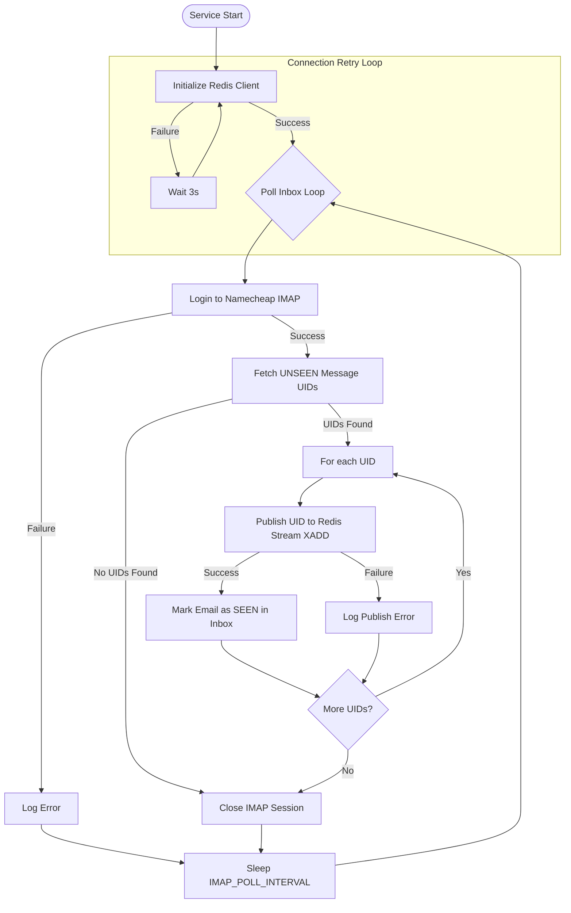

# Poller Microservice — Code & Flow Explanation

This document explains the internal scripts, source code, and execution flow of the **IMAP Poller** microservice. Every line of code is presented and explained.

---

## Execution Flow Diagram

The following Mermaid diagram shows the lifecycle and polling logic executed by `app/main.py` in the poller container:



---

## Complete Code & Line-by-Line Breakdown

### 1. Configuration Script: `app/core/config.py`

This script manages configurations using Pydantic Settings. Below is the full code divided into sequential snippets with explanations for every single line.

#### Snippet 1.1: Imports
```python
from pydantic import AliasChoices, Field
from pydantic_settings import BaseSettings, SettingsConfigDict
```
*   `from pydantic import AliasChoices, Field`: Imports validation utilities from `pydantic`. `AliasChoices` allows mapping multiple alternative environment names, and `Field` configures schema attributes.
*   `from pydantic_settings import BaseSettings, SettingsConfigDict`: Imports configuration loaders from `pydantic_settings`. `BaseSettings` is the base class for environment loading, and `SettingsConfigDict` configures behaviors like file lookups.

#### Snippet 1.2: IMAP Settings Definition
```python
class Settings(BaseSettings):
    # Namecheap IMAP Settings
    IMAP_HOST: str = "mail.privateemail.com"
    IMAP_PORT: int = 993
    IMAP_USERNAME: str | None = None
    IMAP_PASSWORD: str | None = None
    IMAP_POLL_INTERVAL: int = 60  # seconds between inbox checks
```
*   `class Settings(BaseSettings):`: Declares the configuration class. Inheriting from `BaseSettings` triggers Pydantic to lookup matching environment variables automatically on instantiation.
*   `IMAP_HOST: str = "mail.privateemail.com"`: Defines the host address of the IMAP mail server as a string, defaulting to Namecheap Private Email (`mail.privateemail.com`).
*   `IMAP_PORT: int = 993`: Defines the IMAP port as an integer, defaulting to `993` (standard IMAP over SSL).
*   `IMAP_USERNAME: str | None = None`: Declares the mail server username (email address). It is typed as string or `None`, defaulting to `None`.
*   `IMAP_PASSWORD: str | None = None`: Declares the password for the email account, defaulting to `None`.
*   `IMAP_POLL_INTERVAL: int = 60`: Defines the loop sleep duration (in seconds) between mailbox checks, defaulting to `60` seconds.

#### Snippet 1.3: Redis Settings Definition
```python
    # Redis Settings
    REDIS_URL: str = "redis://localhost:6379/0"
    REDIS_STREAM_NAME: str = "email:inbound"
```
*   `REDIS_URL: str = "redis://localhost:6379/0"`: Defines the Redis server connection URI string, pointing by default to localhost database 0.
*   `REDIS_STREAM_NAME: str = "email:inbound"`: Defines the Redis Stream key name as a string, defaulting to `"email:inbound"`.

#### Snippet 1.4: Config Mapping & Instantiation
```python
    model_config = SettingsConfigDict(env_file=("../../.env", ".env"), extra="ignore")


settings = Settings()
```
*   `model_config = SettingsConfigDict(...)`: Configures how Pydantic populates this settings model.
*   `env_file=("../../.env", ".env")`: Instructs Pydantic to search for a `.env` file first two directories above the current running location, and then fallback to the local folder.
*   `extra="ignore"`: Discards variables defined in the `.env` file (like SMTP keys) that do not match fields in this class, preventing validation failures.
*   `settings = Settings()`: Instantiates the config object, triggering Pydantic to read environment/dot-env values and perform type validations.

---

### 2. Main Entry Point: `app/main.py`

This script manages the poller lifecycle and runs the loop.

#### Snippet 2.1: Docstring & Imports
```python
"""
Poller microservice — entry point.

Responsibilities:
  1. Poll Namecheap IMAP inbox every IMAP_POLL_INTERVAL seconds.
  2. Fetch UNSEEN emails and mark them SEEN immediately (claim them).
  3. Publish each email's payload to the Redis Stream "email:inbound".

This service always runs as a single replica (replicas: 1 in docker-compose).
Keeping it at one replica is what prevents two pollers from racing on the same
UNSEEN email.  The Redis Stream + consumer group in the worker handles scale-out
on the processing side.
"""

import json
import logging
import time

import redis
from imap_tools import AND, MailBox, MailMessageFlags

from app.core.config import settings
```
*   `import json`: Imports Python's built-in JSON encoder/decoder.
*   `import logging`: Imports standard logging utilities to print formatted logs.
*   `import time`: Imports time utility to handle sleep intervals.
*   `import redis`: Imports the Redis client package to interface with the stream broker.
*   `from imap_tools import AND, MailBox, MailMessageFlags`: Imports IMAP client wrappers. `AND` constructs IMAP search query filters, `MailBox` handles connections/logins, and `MailMessageFlags` references standard system flags.
*   `from app.core.config import settings`: Imports the config instance.

#### Snippet 2.2: Logger Configuration
```python
logging.basicConfig(
    level=logging.INFO,
    format="%(asctime)s [poller] %(levelname)s %(message)s",
    datefmt="%Y-%m-%dT%H:%M:%S",
)
logger = logging.getLogger(__name__)
```
*   `logging.basicConfig(...)`: Configures the global logging parameters.
*   `level=logging.INFO`: Sets default logging threshold level to `INFO` (suppressing DEBUG statements).
*   `format="..."`: Formats log output with timestamp, service context tag (`[poller]`), severity level, and log message.
*   `datefmt="%Y-%m-%dT%H:%M:%S"`: Formats timestamps as ISO-8601 strings (e.g. `2026-06-23T14:40:00`).
*   `logger = logging.getLogger(__name__)`: Creates the logger instance for the current file module.

#### Snippet 2.3: Redis Client Builder
```python
def _build_redis_client() -> redis.Redis:
    """Create and return a Redis client with connection retry."""
    client = redis.from_url(settings.REDIS_URL, decode_responses=True)
    # Ping to verify connectivity on startup
    client.ping()
    logger.info("Connected to Redis at %s", settings.REDIS_URL)
    return client
```
*   `def _build_redis_client() -> redis.Redis:`: Defines the Redis client construction function.
*   `client = redis.from_url(settings.REDIS_URL, decode_responses=True)`: Instantiates a client using the configuration URL. `decode_responses=True` ensures Redis returns values as standard Python UTF-8 strings.
*   `client.ping()`: Executes a ping connection test. Raises `ConnectionError` if offline.
*   `logger.info(...)`: Logs successful database connection.
*   `return client`: Returns the initialized client object.

#### Snippet 2.4: Polling Logic — Credential Checks & IMAP Connection
```python
def poll_once(r: redis.Redis) -> int:
    """
    Open IMAP, find all UNSEEN message UIDs, publish each UID to the Redis Stream,
    and mark them as SEEN on success.
    Returns the number of emails published.
    """
    username = settings.IMAP_USERNAME
    password = settings.IMAP_PASSWORD

    if not (username and password):
        logger.warning("IMAP credentials not configured — skipping poll.")
        return 0

    published = 0
```
*   `def poll_once(r: redis.Redis) -> int:`: Defines the single-run polling function. Takes a active Redis client.
*   `username = settings.IMAP_USERNAME`: Extracts the IMAP username.
*   `password = settings.IMAP_PASSWORD`: Extracts the IMAP password.
*   `if not (username and password):`: If either credential field is missing, skip checking the mailbox.
*   `logger.warning(...)`: Warns about missing configuration credentials.
*   `return 0`: Safely aborts and returns 0 processed items.
*   `published = 0`: Initializes count of messages successfully queued to Redis.

#### Snippet 2.5: Polling Logic — IMAP Fetch & Redis Push Loop
```python
    try:
        with MailBox(settings.IMAP_HOST, port=settings.IMAP_PORT, timeout=15).login(
            username, password
        ) as mailbox:
            # Fetch UIDs of all unseen emails
            unseen_uids = mailbox.uids(AND(seen=False))
            if not unseen_uids:
                return 0

            logger.info("Found %d unseen email(s) in INBOX.", len(unseen_uids))

            for uid in unseen_uids:
                try:
                    payload = {"uid": uid}
                    # Push UID to the stream
                    stream_id = r.xadd(settings.REDIS_STREAM_NAME, payload)
                    
                    # Successfully added to Redis stream, now mark SEEN in IMAP
                    mailbox.flag(uid, MailMessageFlags.SEEN, True)
                    
                    published += 1
                    logger.info("Published UID %s → stream entry %s and marked SEEN.", uid, stream_id)
                except Exception as exc:  # noqa: BLE001
                    logger.error("Failed to process UID %s: %s", uid, exc)
```
*   `try:`: Opens the main try-catch block for IMAP operations.
*   `with MailBox(settings.IMAP_HOST, port=settings.IMAP_PORT, timeout=15).login(username, password) as mailbox:`:
    *   `MailBox(...)`: Creates the client with configured host and SSL port, setting a connection timeout of 15 seconds.
    *   `.login(...)`: Logs in with credentials.
    *   `as mailbox`: Standard python context manager ensures connection closes properly at the block's end.
*   `unseen_uids = mailbox.uids(AND(seen=False))`: Searches the inbox for all messages with status `UNSEEN`. Returns metadata list of UID strings.
*   `if not unseen_uids:`: If the inbox has no new mail:
*   `return 0`: Return 0.
*   `logger.info(...)`: Log count of unseen emails found.
*   `for uid in unseen_uids:`: Iterates through each unseen email UID.
*   `try:`: Try block to process individual messages safely.
*   `payload = {"uid": uid}`: Prepares the Redis stream entry dictionary payload.
*   `stream_id = r.xadd(settings.REDIS_STREAM_NAME, payload)`: Appends the UID payload to the stream. Returns the generated stream ID.
*   `mailbox.flag(uid, MailMessageFlags.SEEN, True)`: On successful stream write, sets the `\Seen` flag on the mail server to claim the email.
*   `published += 1`: Increments the processed counter.
*   `logger.info(...)`: Logs successful publishing and claiming.
*   `except Exception as exc:`: Catches any error during this specific email transaction.
*   `logger.error(...)`: Logs message processing failure, ensuring loop continues for remaining UIDs.

#### Snippet 2.6: Polling Logic — Error Catching & Returning
```python
    except Exception as exc:  # noqa: BLE001
        logger.error("IMAP connection/fetch error: %s", exc)

    return published
```
*   `except Exception as exc:`: Catches high-level errors (like IMAP authentication failure or network dropouts).
*   `logger.error(...)`: Logs connection or high-level fetch errors.
*   `return published`: Returns the total count of successfully queued messages in this poll cycle.

#### Snippet 2.7: Loop Orchestrator: `run()`
```python
def run() -> None:
    """Main loop — poll forever."""
    # Retry Redis connection on startup (Redis may not be ready yet)
    r: redis.Redis | None = None
    while r is None:
        try:
            r = _build_redis_client()
        except Exception as exc:  # noqa: BLE001
            logger.warning("Redis not ready yet (%s) — retrying in 3s…", exc)
            time.sleep(3)

    logger.info(
        "Poller started. Interval=%ds, stream=%s",
        settings.IMAP_POLL_INTERVAL,
        settings.REDIS_STREAM_NAME,
    )
```
*   `def run() -> None:`: Declares the main run function.
*   `r: redis.Redis | None = None`: Initializes Redis client handle as empty.
*   `while r is None:`: Enters startup retry loop for Redis.
*   `try: r = _build_redis_client()`: Attempts to build client.
*   `except Exception as exc:`: If Redis container is not fully online yet:
*   `logger.warning(...)`: Log warning.
*   `time.sleep(3)`: Sleep for 3 seconds before retrying.
*   `logger.info(...)`: Log successful startup metadata parameters.

#### Snippet 2.8: Loop Logic & Entry Invocation
```python
    while True:
        try:
            count = poll_once(r)
            if count:
                logger.info("Poll complete — %d email(s) queued.", count)
            else:
                logger.debug("Poll complete — inbox empty.")
        except Exception as exc:  # noqa: BLE001
            logger.error("Unexpected error in poll loop: %s", exc)

        time.sleep(settings.IMAP_POLL_INTERVAL)


if __name__ == "__main__":
    run()
```
*   `while True:`: Starts the endless polling loop.
*   `try:`: Catch unexpected runtime errors inside the loop.
*   `count = poll_once(r)`: Execute a single check-and-push run.
*   `if count: logger.info(...)`: If emails were processed, log how many.
*   `else: logger.debug(...)`: If none, log debug state.
*   `except Exception as exc: logger.error(...)`: Log any unhandled exception (preventing container crash).
*   `time.sleep(settings.IMAP_POLL_INTERVAL)`: Sleeps for the configured polling interval.
*   `if __name__ == "__main__": run()`: Standard Python check to launch the service when run directly as a script.
