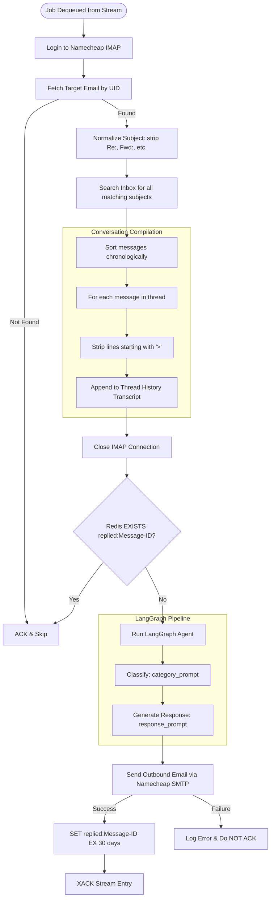

# AI Worker Microservice — Code & Flow Explanation

This document explains the internal scripts, source code, and execution flow of the **AI Worker** microservice.

---

## Execution Flow Diagram

The following Mermaid diagram outlines how a worker pod processes a stream entry (UID job) from Redis:



---

## Script Breakdown & Source Code

### 1. Configuration: `app/core/config.py`
Manages the application configuration settings using Pydantic Settings.

```python
from pydantic import AliasChoices, Field
from pydantic_settings import BaseSettings, SettingsConfigDict


class Settings(BaseSettings):
    # Google Gemini API
    GOOGLE_API_KEY: str = Field(
        validation_alias=AliasChoices("GOOGLE_API_KEY", "GEMINI_API_KEY")
    )
    MODEL_NAME: str = "gemini-2.0-flash"
    TEMPERATURE: float = 0.1

    # Namecheap SMTP (for sending replies)
    SMTP_HOST: str = "mail.privateemail.com"
    SMTP_PORT: int = 587
    SMTP_USERNAME: str | None = None
    SMTP_PASSWORD: str | None = None
    SMTP_FROM_EMAIL: str | None = None
    SMTP_FROM_NAME: str = "Customer Support"

    # Namecheap IMAP Settings (for fetching emails)
    IMAP_HOST: str = "mail.privateemail.com"
    IMAP_PORT: int = 993
    IMAP_USERNAME: str | None = None
    IMAP_PASSWORD: str | None = None

    # Redis Settings
    REDIS_URL: str = "redis://localhost:6379/0"
    REDIS_STREAM_NAME: str = "email:inbound"
    REDIS_CONSUMER_GROUP: str = "complaint-workers"
    # How long (seconds) to remember a replied Message-ID (30 days)
    REDIS_DEDUPE_TTL: int = 2_592_000

    model_config = SettingsConfigDict(env_file=("../../.env", ".env"), extra="ignore")


settings = Settings()
```

---

### 2. SMTP Mail Dispatch: `app/services/email.py`
Creates the MIME message structure and includes threading headers (`In-Reply-To` and `References`) to link emails into a conversational chain in client inboxes.

```python
import smtplib
from email.mime.multipart import MIMEMultipart
from email.mime.text import MIMEText
import logging
from app.core.config import settings

logger = logging.getLogger(__name__)


def send_support_email(
    to_email: str,
    subject: str,
    body_text: str,
    in_reply_to: str | None = None,
    references: str | None = None,
) -> bool:
    """Send an email using Namecheap Private Email SMTP."""
    if not all([settings.SMTP_USERNAME, settings.SMTP_PASSWORD, settings.SMTP_FROM_EMAIL]):
        logger.warning("SMTP credentials are not fully configured. Skipping email dispatch.")
        return False

    try:
        # Create message
        msg = MIMEMultipart()
        msg["From"] = f"{settings.SMTP_FROM_NAME} <{settings.SMTP_FROM_EMAIL}>"
        msg["To"] = to_email
        msg["Subject"] = subject

        if in_reply_to:
            msg["In-Reply-To"] = in_reply_to
        if references:
            msg["References"] = references

        msg.attach(MIMEText(body_text, "plain"))

        # Connect and send
        if settings.SMTP_PORT == 465:
            server = smtplib.SMTP_SSL(settings.SMTP_HOST, settings.SMTP_PORT, timeout=10)
        else:
            server = smtplib.SMTP(settings.SMTP_HOST, settings.SMTP_PORT, timeout=10)
            server.starttls()

        server.login(settings.SMTP_USERNAME, settings.SMTP_PASSWORD)
        server.send_message(msg)
        server.quit()
        logger.info("Successfully sent email to %s", to_email)
        return True
    except Exception as e:
        logger.error("Failed to send email via SMTP: %s", e)
        return False
```

---

### 3. AI Prompts: `app/services/agent/prompts.py`
Declares the prompts for classifying complaint categories and generating context-aware support responses.

```python
from langchain_core.prompts import ChatPromptTemplate

category_prompt = ChatPromptTemplate.from_messages([
    ("system", "You are a helpful assistant that classifies customer complaints into one of these categories: delivery, refund, product issue, other. Respond with only the category name, nothing else."),
    ("user", "Conversation Thread:\n{input}"),
])

response_prompt = ChatPromptTemplate.from_messages([
    ("system", "You are a helpful customer service assistant that generates professional and empathetic responses. The complaint category is: {complaint_type}."),
    ("user", (
        "Generate a professional and empathetic response to the customer's latest request in the following conversation thread.\n\n"
        "Conversation Thread:\n{complaint}\n\n"
        "Note: Provide only a single response message addressing the customer's latest request, keeping the thread history in mind."
    )),
])
```

---

### 4. LangGraph Setup: `app/services/agent/agent.py`
Compiles a stateless LangGraph workflow linking category classification and support response generation.

```python
from typing import TypedDict

from langchain_google_genai import ChatGoogleGenerativeAI
from langgraph.graph import END, START, StateGraph

from app.core.config import settings
from app.services.agent.prompts import category_prompt, response_prompt


# Canonical LangGraph state pattern: TypedDict (NOT Pydantic BaseModel)
class ComplaintState(TypedDict):
    complaint: str
    complaint_type: str
    response: str


# api_key is the preferred alias per langchain-google-genai reference docs
_llm = ChatGoogleGenerativeAI(
    model=settings.MODEL_NAME,
    temperature=settings.TEMPERATURE,
    api_key=settings.GOOGLE_API_KEY,
)

_classify_chain = category_prompt | _llm
_response_chain = response_prompt | _llm


def _node_classify(state: ComplaintState) -> dict:
    """Classify the complaint into a category."""
    ai_response = _classify_chain.invoke({"input": state["complaint"]})
    # .text works for both plain-string (Gemini 2.x) and content-block list (Gemini 3+)
    return {"complaint_type": ai_response.text.strip().lower()}


def _node_respond(state: ComplaintState) -> dict:
    """Generate a professional response to the complaint."""
    ai_response = _response_chain.invoke({
        "complaint": state["complaint"],
        "complaint_type": state["complaint_type"],
    })
    return {"response": ai_response.text}


_workflow = StateGraph(ComplaintState)
_workflow.add_node("classify", _node_classify)
_workflow.add_node("respond", _node_respond)
_workflow.add_edge(START, "classify")
_workflow.add_edge("classify", "respond")
_workflow.add_edge("respond", END)

_app = _workflow.compile()


def process_complaint(complaint_text: str, thread_id: str | None = None) -> dict:
    """Run the LangGraph workflow and return classification + response."""
    result = _app.invoke(
        {"complaint": complaint_text, "complaint_type": "", "response": ""}
    )
    return {
        "complaint": complaint_text,
        "complaint_type": result["complaint_type"],
        "response": result["response"],
    }
```

---

### 5. Main Loop & Message Processing: `app/main.py`
Joins the consumer group, polls Redis for UIDs, logs into IMAP to dynamically construct the thread history transcript, triggers the LangGraph handler, dispatches the SMTP reply, and sends the queue ACK.

```python
"""
Worker microservice — entry point.

Responsibilities:
  1. Join Redis Stream consumer group "complaint-workers".
  2. Block-read messages from the "email:inbound" stream (XREADGROUP).
     - Each message is delivered to exactly ONE worker replica.
  3. For each message:
     a. Check Redis dedupe key "replied:{message_id}" — skip if already handled.
     b. Run LangGraph complaint handler → generate AI response.
     c. Send SMTP reply via Namecheap.
     d. SET dedupe key with 30-day TTL.
     e. XACK the stream message (removes it from the Pending Entry List).

Scale freely — Redis Stream consumer groups ensure each email is processed
by exactly one worker even when multiple replicas are running.
"""

import logging
import socket
import time

import redis
from imap_tools import AND, MailBox

from app.core.config import settings
from app.services.agent.agent import process_complaint
from app.services.email import send_support_email

logging.basicConfig(
    level=logging.INFO,
    format="%(asctime)s [worker/%(hostname)s] %(levelname)s %(message)s",
    datefmt="%Y-%m-%dT%H:%M:%S",
)

# Include hostname in every log line so you can distinguish replicas
_hostname = socket.gethostname()
logging.getLogger().handlers[0].setFormatter(
    logging.Formatter(
        fmt=f"%(asctime)s [worker/{_hostname}] %(levelname)s %(message)s",
        datefmt="%Y-%m-%dT%H:%M:%S",
    )
)

logger = logging.getLogger(__name__)


# ---------------------------------------------------------------------------
# Redis helpers
# ---------------------------------------------------------------------------

def _build_redis_client() -> redis.Redis:
    """Create Redis client with retry on startup."""
    client = redis.from_url(settings.REDIS_URL, decode_responses=True)
    client.ping()
    logger.info("Connected to Redis at %s", settings.REDIS_URL)
    return client


def _ensure_consumer_group(r: redis.Redis) -> None:
    """
    Create the consumer group if it doesn't exist yet.
    MKSTREAM creates the stream key if it's also missing.
    '$' means: only process NEW messages added after group creation.
    """
    try:
        r.xgroup_create(
            name=settings.REDIS_STREAM_NAME,
            groupname=settings.REDIS_CONSUMER_GROUP,
            id="$",
            mkstream=True,
        )
        logger.info(
            "Created consumer group '%s' on stream '%s'.",
            settings.REDIS_CONSUMER_GROUP,
            settings.REDIS_STREAM_NAME,
        )
    except redis.exceptions.ResponseError as exc:
        if "BUSYGROUP" in str(exc):
            # Group already exists — this is fine (other worker replica created it first)
            logger.debug("Consumer group already exists — OK.")
        else:
            raise


def _dedupe_key(message_id: str) -> str:
    return f"replied:{message_id}"


# ---------------------------------------------------------------------------
# Message processing
# ---------------------------------------------------------------------------

def _handle_message(r: redis.Redis, stream_entry_id: str, fields: dict) -> None:
    """
    Process a single email from the stream by fetching it from IMAP using UID.
    Always ACKs the message if handled successfully or if it's an unrecoverable/skipped scenario.
    """
    uid = fields.get("uid", "")
    logger.info("Received job for email UID %s (stream_id=%s)", uid, stream_entry_id)

    if not uid:
        logger.warning("No UID found in stream entry %s — skipping.", stream_entry_id)
        r.xack(settings.REDIS_STREAM_NAME, settings.REDIS_CONSUMER_GROUP, stream_entry_id)
        return

    # Check that IMAP config is available
    if not (settings.IMAP_USERNAME and settings.IMAP_PASSWORD):
        logger.error("IMAP settings are not configured in worker — cannot fetch email %s", uid)
        raise ValueError("IMAP settings are not configured in worker.")

    try:
        # ── 1. Fetch email and its thread history from IMAP on-demand ────────
        with MailBox(settings.IMAP_HOST, port=settings.IMAP_PORT, timeout=15).login(
            settings.IMAP_USERNAME, settings.IMAP_PASSWORD
        ) as mailbox:
            # Fetch the target email by UID
            messages = list(mailbox.fetch(AND(uid=uid)))
            if not messages:
                logger.warning("Email with UID %s not found in mailbox — skipping.", uid)
                r.xack(settings.REDIS_STREAM_NAME, settings.REDIS_CONSUMER_GROUP, stream_entry_id)
                return
            
            msg = messages[0]
            from_email = msg.from_
            subject = msg.subject or "(no subject)"
            message_id = msg.obj.get("Message-ID", "").strip()
            references = msg.obj.get("References", "").strip()
            in_reply_to = msg.obj.get("In-Reply-To", "").strip()
            
            thread_id = (
                in_reply_to
                or references
                or message_id
                or f"thread_{abs(hash(from_email + subject)) % 100_000}"
            )

            # Normalize the subject to find all messages in the same conversation thread
            def normalize_subject(subj: str) -> str:
                s = subj.lower()
                for prefix in ["re:", "fwd:", "fw:"]:
                    if s.startswith(prefix):
                        s = s[len(prefix):].strip()
                return s.strip()

            norm_subj = normalize_subject(subject)

            # Fetch all messages in the current folder (INBOX) matching this normalized subject
            # This fetches the entire history of customer emails in this thread
            thread_messages = list(mailbox.fetch(AND(subject=norm_subj)))
            thread_messages.sort(key=lambda m: m.date or m.date_str)

            # Construct the chronological thread history
            thread_history = ""
            for m in thread_messages:
                m_sender = m.from_
                m_date = m.date.strftime("%Y-%m-%d %H:%M:%S") if m.date else "Unknown Date"
                m_body = m.text.strip() if m.text else m.html.strip() if m.html else ""
                
                # Clean body part: remove lines starting with '>' (quoted reply history)
                # to prevent duplicating the conversation history in the prompt.
                clean_lines = [line for line in m_body.splitlines() if not line.strip().startswith(">")]
                clean_body = "\n".join(clean_lines).strip()
                
                thread_history += f"From: {m_sender} (Date: {m_date})\nSubject: {m.subject}\nContent:\n{clean_body}\n\n---\n\n"

        logger.info(
            "Fetched thread history for subject=%r (%d message(s), message_id=%s)",
            subject,
            len(thread_messages),
            message_id,
        )

        # ── 2. Dedupe check ─────────────────────────────────────────────────
        if message_id:
            key = _dedupe_key(message_id)
            if r.exists(key):
                logger.warning(
                    "Already replied to Message-ID %s — skipping duplicate.", message_id
                )
                r.xack(settings.REDIS_STREAM_NAME, settings.REDIS_CONSUMER_GROUP, stream_entry_id)
                return
        else:
            logger.warning("Email has no Message-ID header — dedupe not possible.")

        # ── 3. Validate ─────────────────────────────────────────────────────
        if not from_email or not thread_history.strip():
            logger.warning("Missing from_email or thread history — skipping.")
            r.xack(settings.REDIS_STREAM_NAME, settings.REDIS_CONSUMER_GROUP, stream_entry_id)
            return

        # ── 4. Run LangGraph AI agent ────────────────────────────────────────
        logger.info("Running LangGraph complaint handler for thread_id=%s", thread_id)
        result = process_complaint(thread_history, thread_id=thread_id)
        logger.info("Classified as: %s", result["complaint_type"])

        # ── 5. Build reply subject ──────────────────────────────────────────
        reply_subject = subject if subject.lower().startswith("re:") else f"Re: {subject}"

        # ── 6. Send SMTP reply ──────────────────────────────────────────────
        sent = send_support_email(
            to_email=from_email,
            subject=reply_subject,
            body_text=result["response"],
            in_reply_to=message_id or None,
            references=f"{references} {message_id}".strip() or None,
        )

        # ── 7. Mark as replied in Redis ─────────────────────────────────────
        if sent and message_id:
            r.set(_dedupe_key(message_id), "1", ex=settings.REDIS_DEDUPE_TTL)
            logger.info("Marked Message-ID %s as replied (TTL=%ds).", message_id, settings.REDIS_DEDUPE_TTL)

        # ── 8. Success ACK ──────────────────────────────────────────────────
        r.xack(settings.REDIS_STREAM_NAME, settings.REDIS_CONSUMER_GROUP, stream_entry_id)
        logger.info("Successfully processed and ACKed stream entry %s", stream_entry_id)

    except Exception as exc:  # noqa: BLE001
        logger.error("Error processing message %s: %s", stream_entry_id, exc)


# ---------------------------------------------------------------------------
# Main loop
# ---------------------------------------------------------------------------

def run() -> None:
    """Consume the Redis Stream forever."""

    # Retry Redis connection on startup (Redis container may not be ready yet)
    r: redis.Redis | None = None
    while r is None:
        try:
            r = _build_redis_client()
        except Exception as exc:  # noqa: BLE001
            logger.warning("Redis not ready yet (%s) — retrying in 3s…", exc)
            time.sleep(3)

    _ensure_consumer_group(r)

    logger.info(
        "Worker started. stream=%s group=%s consumer=%s",
        settings.REDIS_STREAM_NAME,
        settings.REDIS_CONSUMER_GROUP,
        _hostname,
    )

    while True:
        try:
            # XREADGROUP: block up to 5 seconds waiting for a new message.
            # ">" means "give me messages not yet delivered to any consumer."
            # COUNT 10 means process up to 10 emails per batch.
            response = r.xreadgroup(
                groupname=settings.REDIS_CONSUMER_GROUP,
                consumername=_hostname,
                streams={settings.REDIS_STREAM_NAME: ">"},
                count=10,
                block=5000,  # ms
            )

            if not response:
                # Timeout — no new messages, loop back
                continue

            # response shape: [(stream_name, [(entry_id, fields_dict), ...])]
            for _stream_name, entries in response:
                for entry_id, fields in entries:
                    _handle_message(r, entry_id, fields)

        except redis.exceptions.ConnectionError as exc:
            logger.error("Redis connection lost: %s — reconnecting in 5s…", exc)
            time.sleep(5)
            try:
                r = _build_redis_client()
            except Exception:  # noqa: BLE001
                pass

        except Exception as exc:  # noqa: BLE001
            logger.error("Unexpected error in worker loop: %s", exc)
            time.sleep(1)


if __name__ == "__main__":
    run()
```
