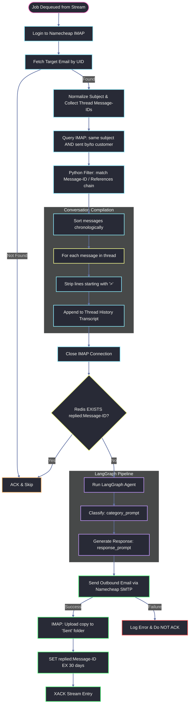
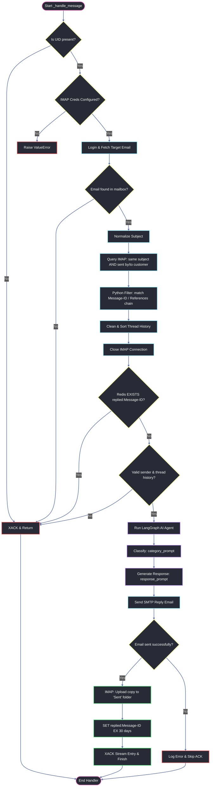

# AI Worker Microservice — Code & Flow Explanation

This document explains the internal scripts, source code, and execution flow of the **AI Worker** microservice. Every line of code is presented and explained.

---

## Execution Flow Diagram

The following Mermaid diagram outlines how a worker pod processes a stream entry (UID job) from Redis:



---

## Complete Code & Line-by-Line Breakdown

### 1. Configuration Script: `app/core/config.py`

This script manages configurations using Pydantic Settings.

#### Snippet 1.1: Imports & Class Declaration
```python
# Import alias mapping and schema validation fields from Pydantic
from pydantic import AliasChoices, Field
# Import configuration loader and base settings class from Pydantic Settings
from pydantic_settings import BaseSettings, SettingsConfigDict


# Define the main settings class inheriting from Pydantic's BaseSettings
class Settings(BaseSettings):
```

#### Snippet 1.2: AI & Private Email Settings
```python
    # Configures the Google Gemini API key, mapping both GOOGLE_API_KEY and GEMINI_API_KEY env variables
    GOOGLE_API_KEY: str = Field(
        validation_alias=AliasChoices("GOOGLE_API_KEY", "GEMINI_API_KEY")
    )
    # The default Gemini model name string to run our classifications and generations
    MODEL_NAME: str = "gemini-3.5-flash"
    # Setting the generation temperature parameter to a deterministic low value (0.1)
    TEMPERATURE: float = 0.1

    # Host address of the Namecheap Private Email SMTP/IMAP server
    HOST: str = "mail.privateemail.com"
    # Account password retrieved from environment configuration
    PRIVATE_MAIL_PASSWORD: str | None = None
    # Username (email address) retrieved from environment configuration
    PRIVATE_MAIL_EMAIL_ID: str | None = None

    # Standard SSL IMAP port to check inbox messages
    IMAP_PORT: int = 993
    # Standard STARTTLS SMTP port to establish secure outbound email connections
    SMTP_PORT: int = 587

    # Display sender name shown to recipients (e.g. "Customer Support")
    FROM_NAME: str = "Customer Support"
```

#### Snippet 1.3: Redis settings & Instantiation
```python
    # Connection URL path of our Redis database server
    REDIS_URL: str = "redis://localhost:6379/0"
    # Key name of the Redis Stream queue containing inbound email jobs
    REDIS_STREAM_NAME: str = "email:inbound"
    # Consumer group name coordinating load balancing across active workers
    REDIS_CONSUMER_GROUP: str = "complaint-workers"
    # Expiration time (30 days in seconds) of Message-ID deduplication cache keys
    REDIS_DEDUPE_TTL: int = 2_592_000

    # Configure Pydantic Settings search path for .env files and ignore extra keys
    model_config = SettingsConfigDict(env_file=("../../.env", ".env"), extra="ignore")


# Instantiate the Settings class to parse and load all configurations
settings = Settings()
```

---

### 2. SMTP Mailer: `app/services/email.py`

This script builds and dispatches the outgoing MIME emails.

#### Snippet 2.1: Imports & Loggers
```python
# Import the Python built-in SMTP protocol handler module
import smtplib
# Import the MIME multipart container class to construct email segments
from email.mime.multipart import MIMEMultipart
# Import the MIME text class to handle plain text email bodies
from email.mime.text import MIMEText
# Import make_msgid utility to generate unique Message-ID headers for emails
from email.utils import make_msgid
# Import the logging module to output structured diagnostic messages
import logging
# Import the global configuration instance containing SMTP credentials
from app.core.config import settings

# Create a logger instance scoped to this service file module
logger = logging.getLogger(__name__)
```

#### Snippet 2.2: Email Drafting & Dispatch Logic
```python
# Define function to build and send outbound customer reply emails
def send_support_email(
    # Recipient email address
    to_email: str,
    # Email subject string
    subject: str,
    # Plain text content of the email reply body
    body_text: str,
    # Thread identifier Message-ID being replied to
    in_reply_to: str | None = None,
    # List of message reference IDs in the conversation thread
    references: str | None = None,
) -> bool: # Returns boolean indicating whether SMTP dispatch succeeded
    # Verify that all required login credentials are populated
    if not all([settings.PRIVATE_MAIL_EMAIL_ID, settings.PRIVATE_MAIL_PASSWORD]):
        # Log warning indicating SMTP cannot be invoked due to missing configuration
        logger.warning("SMTP credentials are not fully configured. Skipping email dispatch.")
        # Return False to signify failed dispatch
        return False
```

#### Snippet 2.3: MIME Construction & Header Injection
```python
    try:
        # Create message container object handling standard multipart MIME formats
        msg = MIMEMultipart()
        # Set the formatted "From" header containing support name and sender email
        msg["From"] = f"{settings.FROM_NAME} <{settings.PRIVATE_MAIL_EMAIL_ID}>"
        # Set the destination target recipient address header
        msg["To"] = to_email

        # Ensure reply subject starts with "Re:" if not already present
        if subject and not subject.lower().startswith("re:"):
            # Prepend the standard "Re: " prefix to the subject
            subject = f"Re: {subject}"
        # Set the email subject line header
        msg["Subject"] = subject

        # Generate a unique Message-ID header for this outgoing email to allow client threading
        msg["Message-ID"] = make_msgid()

        # If replying to a specific email, insert the In-Reply-To header
        if in_reply_to:
            msg["In-Reply-To"] = in_reply_to
        # If references exist, insert the References header to maintain threading on mail clients
        if references:
            msg["References"] = references

        # Attach the reply body text as a plain text MIME segment using explicit UTF-8 encoding
        msg.attach(MIMEText(body_text, "plain", "utf-8"))
```

#### Snippet 2.4: SMTP Connections & Login
```python
        # Check if the port requires direct SSL connection
        if settings.SMTP_PORT == 465:
            # Connect using direct SMTP over SSL socket with a 10s connection timeout
            server = smtplib.SMTP_SSL(settings.HOST, settings.SMTP_PORT, timeout=10)
        # If using standard port 587 or clear socket
        else:
            # Connect using standard SMTP socket with a 10s connection timeout
            server = smtplib.SMTP(settings.HOST, settings.SMTP_PORT, timeout=10)
            # Upgrade the socket connection to encrypted TLS tunnel (STARTTLS)
            server.starttls()

        # Log into the SMTP server using configuration credentials
        server.login(settings.PRIVATE_MAIL_EMAIL_ID, settings.PRIVATE_MAIL_PASSWORD)
        # Dispatch the compiled MIME message object to the recipient
        server.send_message(msg)
        # Safely close the SMTP server connection
        server.quit()
        # Log success info message
        logger.info("Successfully sent email to %s", to_email)

        # Upload a copy of the sent email to IMAP "Sent" folder so it appears in mail UI
        if settings.PRIVATE_MAIL_EMAIL_ID and settings.PRIVATE_MAIL_PASSWORD:
            try:
                # Import MailBox from imap_tools dynamically
                from imap_tools import MailBox
                # Connect to the IMAP server and login using credentials
                with MailBox(settings.HOST, port=settings.IMAP_PORT, timeout=10).login(
                    settings.PRIVATE_MAIL_EMAIL_ID, settings.PRIVATE_MAIL_PASSWORD
                ) as mailbox:
                    # Append the compiled MIME message as raw bytes to the "Sent" folder
                    mailbox.append(msg.as_bytes(), "Sent")
                # Log success of Sent folder upload
                logger.info("Uploaded a copy of sent email to IMAP 'Sent' folder.")
            # Catch any failure during the IMAP upload process and log it as warning
            except Exception as imap_err:
                logger.warning("Could not copy sent email to IMAP 'Sent' folder: %s", imap_err)

        # Return True indicating successful email dispatch
        return True
    # Catch any connection, authentication or SMTP socket exception
    except Exception as e:
        # Log the error details for diagnostics
        logger.error("Failed to send email via SMTP: %s", e)
        # Return False indicating failed email dispatch
        return False
```

---

### 3. AI Prompts: `app/services/agent/prompts.py`

This script declares prompts.

```python
# Import the template composer class from LangChain core
from langchain_core.prompts import ChatPromptTemplate

# Compile prompt template for classification, forcing categorical answers
category_prompt = ChatPromptTemplate.from_messages([
    # System instruction template forcing worker agent to output only one string name
    ("system", "You are a helpful assistant that classifies customer complaints into one of these categories: delivery, refund, product issue, other. Respond with only the category name, nothing else."),
    # Inject the raw chronological thread history as the user query context
    ("user", "Conversation Thread:\n{input}"),
])

# Compile prompt template for support reply generation, injecting category context
response_prompt = ChatPromptTemplate.from_messages([
    # System persona template instructing AI to draft a response customized to the category
    ("system", "You are a helpful customer service assistant that generates professional and empathetic responses. The complaint category is: {complaint_type}."),
    # Request generation based on the conversation thread context
    ("user", (
        "Generate a professional and empathetic response to the customer's latest request in the following conversation thread.\n\n"
        "Conversation Thread:\n{complaint}\n\n"
        "Note: Provide only a single response message addressing the customer's latest request, keeping the thread history in mind."
    )),
])
```

---

### 4. Agent Configuration: `app/services/agent/agent.py`

This script compiles the LangGraph State Graph.

#### Snippet 4.1: Imports & State definition
```python
# Import TypedDict structure to validate state graph payloads
from typing import TypedDict

# Import Google Gemini API client compiler from langchain-google-genai
from langchain_google_genai import ChatGoogleGenerativeAI
# Import graph nodes and graph compiler from LangGraph
from langgraph.graph import END, START, StateGraph

# Import global settings instance containing model and temperature configuration
from app.core.config import settings
# Import category classification and response templates
from app.services.agent.prompts import category_prompt, response_prompt


# Declare State Graph schema containing inputs, classifications, and outputs
class ComplaintState(TypedDict):
    # Contains the full chronological conversation thread history
    complaint: str
    # Contains the final resolved category class string
    complaint_type: str
    # Contains the compiled final outbound support email text
    response: str
```

#### Snippet 4.2: Gemini & Chains Definition
```python
# Initialize Google Gemini Chat Client using settings parameters
_llm = ChatGoogleGenerativeAI(
    # Load model name (gemini-3.5-flash)
    model=settings.MODEL_NAME,
    # Configure generation temperature (0.1)
    temperature=settings.TEMPERATURE,
    # Pass authenticated API key
    api_key=settings.GOOGLE_API_KEY,
)

# Compose the classification LCEL pipeline chain
_classify_chain = category_prompt | _llm
# Compose the response generation LCEL pipeline chain
_response_chain = response_prompt | _llm
```

#### Snippet 4.3: Node Implementations
```python
# Define state graph node function for thread classification
def _node_classify(state: ComplaintState) -> dict:
    # Run the classification chain on the state's conversation thread history
    ai_response = _classify_chain.invoke({"input": state["complaint"]})
    # Return dictionary updating the complaint_type key in the state graph
    return {"complaint_type": ai_response.text.strip().lower()}


# Define state graph node function for response email drafting
def _node_respond(state: ComplaintState) -> dict:
    # Run response chain using thread history and classification category
    ai_response = _response_chain.invoke({
        "complaint": state["complaint"],
        "complaint_type": state["complaint_type"],
    })
    # Return dictionary updating the response key in the state graph
    return {"response": ai_response.text}
```

#### Snippet 4.4: Graph Composition & wrapper function
```python
# Initialize StateGraph object using State schema
_workflow = StateGraph(ComplaintState)
# Add classification node to graph directory
_workflow.add_node("classify", _node_classify)
# Add response node to graph directory
_workflow.add_node("respond", _node_respond)
# Connect graph start point directly to classification node
_workflow.add_edge(START, "classify")
# Connect classification node directly to response node
_workflow.add_edge("classify", "respond")
# Connect response node directly to graph termination point
_workflow.add_edge("respond", END)

# Compile graph into executable LangGraph app
_app = _workflow.compile()


# Define wrapper function to execute the LangGraph workflow pipeline
def process_complaint(complaint_text: str, thread_id: str | None = None) -> dict:
    # Invoke LangGraph workflow with conversation state variables
    result = _app.invoke(
        {"complaint": complaint_text, "complaint_type": "", "response": ""}
    )
    # Return compiled dict containing inputs, classifications, and responses
    return {
        "complaint": complaint_text,
        "complaint_type": result["complaint_type"],
        "response": result["response"],
    }
```

---

### 5. Main Execution: `app/main.py`

This is the main worker loop and pipeline orchestrator.

#### Snippet 5.1: Docstring & Imports
```python
# Import logging module to print structured messages
import logging
# Import socket module to retrieve host details
import socket
# Import time module to execute sleep delays
import time

# Import redis-py client
import redis
# Import mail filters and mailbox client from imap-tools
from imap_tools import AND, MailBox, OR

# Import global settings loader
from app.core.config import settings
# Import LangGraph execution pipeline wrapper
from app.services.agent.agent import process_complaint
# Import SMTP email service wrapper
from app.services.email import send_support_email
```

#### Snippet 5.2: Replica-logging Setup
```python
# Configure basic logging properties with timezone and tags
logging.basicConfig(
    level=logging.INFO,
    format="%(asctime)s [worker/%(hostname)s] %(levelname)s %(message)s",
    datefmt="%Y-%m-%dT%H:%M:%S",
)

# Retrieve current container hostname to identify logs from individual worker replicas
_hostname = socket.gethostname()
# Inject hostname parameter directly into log formatter structure
logging.getLogger().handlers[0].setFormatter(
    logging.Formatter(
        fmt=f"%(asctime)s [worker/{_hostname}] %(levelname)s %(message)s",
        datefmt="%Y-%m-%dT%H:%M:%S",
    )
)

# Initialize logging context for the script module
logger = logging.getLogger(__name__)
```

#### Snippet 5.3: Redis client & Consumer Group Checks
```python
# Define function to construct Redis connection client with retry configurations
def _build_redis_client() -> redis.Redis:
    # Instantiate Redis client setting socket timeout parameter to 15s to handle block intervals
    client = redis.from_url(settings.REDIS_URL, decode_responses=True, socket_timeout=15)
    # Validate connection immediately by executing a ping command
    client.ping()
    # Log connection success details
    logger.info("Connected to Redis at %s", settings.REDIS_URL)
    # Return client handle
    return client


# Define function to establish joint stream consumer group
def _ensure_consumer_group(r: redis.Redis) -> None:
    try:
        # Create group, setting consumer start point to '$' (new messages only)
        r.xgroup_create(
            name=settings.REDIS_STREAM_NAME,
            groupname=settings.REDIS_CONSUMER_GROUP,
            id="$",
            mkstream=True, # Automatically creates stream queue key if it doesn't exist
        )
        # Log consumer group creation details
        logger.info(
            "Created consumer group '%s' on stream '%s'.",
            settings.REDIS_CONSUMER_GROUP,
            settings.REDIS_STREAM_NAME,
        )
    # Catch exceptions raised during Redis command execution
    except redis.exceptions.ResponseError as exc:
        # If group already exists, allow execution to proceed (handled during scaling)
        if "BUSYGROUP" in str(exc):
            # Log debug confirmation message
            logger.debug("Consumer group already exists — OK.")
        # Raise any other critical Redis error
        else:
            raise
```

#### Snippet 5.4: Deduplication Key Creator
```python
# Define helper function returning cache key naming convention for replies
def _dedupe_key(message_id: str) -> str:
    # Prepend key identifier prefix to message header ID
    return f"replied:{message_id}"
```

---

### Detailed `_handle_message` Execution Flow

The `_handle_message` function is the core of the worker service. It processes a single job from the Redis Stream, compiling a thread transcript from IMAP, running the LangGraph AI agent, sending the SMTP response, and acknowledging the queue entry.

Here is a step-by-step execution flow of the handler:



---

#### Snippet 5.5: Processing Handler — UID validation
```python
def _handle_message(r: redis.Redis, stream_entry_id: str, fields: dict) -> None:
    """
    Process a single email from the stream by fetching it from IMAP using UID.
    Always ACKs the message if handled successfully or if it's an unrecoverable/skipped scenario.
    """
    # Extract email UID string from stream payload parameters
    uid = fields.get("uid", "")
    
    # Log incoming job details
    logger.info("Received job for email UID %s (stream_id=%s)", uid, stream_entry_id)

    # Validate that UID is present in queue message
    if not uid:
        # Log warning indicating empty UID payload
        logger.warning("No UID found in stream entry %s — skipping.", stream_entry_id)
        # Acknowledge entry immediately to remove it from consumer pending list
        r.xack(settings.REDIS_STREAM_NAME, settings.REDIS_CONSUMER_GROUP, stream_entry_id)
        # Stop processing
        return

    # Verify that IMAP email configurations are present
    if not (settings.PRIVATE_MAIL_EMAIL_ID and settings.PRIVATE_MAIL_PASSWORD):
        # Log critical configuration error details
        logger.error("IMAP settings are not configured in worker — cannot fetch email %s", uid)
        # Raise configuration error
        raise ValueError("IMAP settings are not configured in worker.")
```

#### Snippet 5.6: Processing Handler — On-Demand Thread Compiling
```python
    try:
        # Connect and authenticate with the IMAP server using a context manager
        with MailBox(settings.HOST, port=settings.IMAP_PORT, timeout=15).login(
            settings.PRIVATE_MAIL_EMAIL_ID, settings.PRIVATE_MAIL_PASSWORD
        ) as mailbox:
            # Fetch the target email object using its specific UID
            messages = list(mailbox.fetch(AND(uid=uid)))
            
            # Verify that target email exists in the mailbox
            if not messages:
                # Log warning indicating email has been deleted or moved
                logger.warning("Email with UID %s not found in mailbox — skipping.", uid)
                # Acknowledge message in Redis to remove it from PEL queue
                r.xack(settings.REDIS_STREAM_NAME, settings.REDIS_CONSUMER_GROUP, stream_entry_id)
                # Stop processing
                return
            
            # Extract main message object
            msg = messages[0]
            # Get sender address
            from_email = msg.from_
            # Get subject string, defaulting if empty
            subject = msg.subject or "(no subject)"
            # Get unique Message-ID header
            message_id = msg.obj.get("Message-ID", "").strip()
            # Get references headers (used to link messages in a thread)
            references = msg.obj.get("References", "").strip()
            # Get reply mapping header
            in_reply_to = msg.obj.get("In-Reply-To", "").strip()
            
            # Compile thread ID using headers, falling back to a hash of sender + subject
            thread_id = (
                in_reply_to
                or references
                or message_id
                or f"thread_{abs(hash(from_email + subject)) % 100_000}"
            )

            # Define helper function to strip conversation prefixes (e.g. Re:, Fwd:)
            def normalize_subject(subj: str) -> str:
                s = subj.lower()
                for prefix in ["re:", "fwd:", "fw:"]:
                    if s.startswith(prefix):
                        s = s[len(prefix):].strip()
                return s.strip()

            # Define helper function to extract all associated Message-IDs from email headers
            def collect_thread_message_ids(message_id_: str, references_: str, in_reply_to_: str) -> set:
                """
                Collect every Message-ID that belongs to this email's thread,
                based on RFC 2822/5322 threading headers (References / In-Reply-To).
                This is the canonical way mail clients (Gmail, Outlook, Apple Mail)
                group conversations — far more reliable than subject-text matching.
                """
                # Initialize an empty set to store the Message-IDs
                ids = set()
                # If a valid Message-ID exists, add it to the set
                if message_id_:
                    ids.add(message_id_)
                # If a References header exists, split by space and add all IDs to the set
                if references_:
                    ids.update(references_.split())
                # If an In-Reply-To header exists, add it to the set
                if in_reply_to_:
                    ids.add(in_reply_to_)
                # Return the set of unique Message-IDs
                return ids

            # Normalize current email subject
            norm_subj = normalize_subject(subject)
            # Collect all known Message-IDs associated with this conversation thread
            thread_msg_ids = collect_thread_message_ids(message_id, references, in_reply_to)

            # ── 1a. Narrow candidate pool server-side: same normalized subject
            #        AND (sent by this customer OR sent to this customer).
            #        This is cheap (IMAP-indexed) but NOT sufficient on its own —
            #        two different customers can share an identical subject line
            #        (e.g. "Refund request"), which would otherwise leak one
            #        customer's thread into another's context.
            candidates = list(
                # Query IMAP to find candidates with matching subject and sent by/to this customer
                mailbox.fetch(
                    AND(subject=norm_subj) & OR(from_=from_email, to=from_email)
                )
            )

            # ── 1b. Strict filter in Python using the Message-ID/References
            #        chain, so we only keep messages that are *actually* part
            #        of this exact conversation — not just same-subject noise
            #        from a different customer, and not lost due to subject
            #        text drift (extra "FWD:", translated "Re:", etc.).
            if thread_msg_ids:
                # Filter candidates to only keep emails matching the Message-ID/References chain
                thread_messages = [
                    m for m in candidates
                    if m.obj.get("Message-ID", "").strip() in thread_msg_ids
                    or (thread_msg_ids & set(m.obj.get("References", "").strip().split()))
                    or (m.obj.get("In-Reply-To", "").strip() in thread_msg_ids)
                ]
                # Ensure the triggering message is always included in the thread context
                if not any(m.obj.get("Message-ID", "").strip() == message_id for m in thread_messages):
                    thread_messages.append(msg)
            else:
                # If no headers exist, fall back to the subject-matched candidate list
                thread_messages = candidates or [msg]

            # Sort thread messages in chronological order
            thread_messages.sort(key=lambda m: m.date or m.date_str)

            # Compile text transcript of conversation history
            thread_history = ""
            # Loop through sorted thread messages
            for m in thread_messages:
                # Extract sender address
                m_sender = m.from_
                # Format message date to YYYY-MM-DD HH:MM:SS or fallback
                m_date = m.date.strftime("%Y-%m-%d %H:%M:%S") if m.date else "Unknown Date"
                # Retrieve body text, defaulting to HTML if text is empty
                m_body = m.text.strip() if m.text else m.html.strip() if m.html else ""
                
                # Strip out reply quotes (lines starting with '>') to clean up prompt context
                clean_lines = [line for line in m_body.splitlines() if not line.strip().startswith(">")]
                # Join clean body lines back together
                clean_body = "\n".join(clean_lines).strip()
                
                # Append clean message content to transcript history
                thread_history += f"From: {m_sender} (Date: {m_date})\nSubject: {m.subject}\nContent:\n{clean_body}\n\n---\n\n"

        # Log compilation completion details
        logger.info(
            "Fetched thread history for subject=%r (%d message(s), message_id=%s)",
            subject,
            len(thread_messages),
            message_id,
        )
```

#### Snippet 5.7: Processing Handler — Dedupe, Agent & Dispatch
```python
        # Check if Message-ID exists to run deduplication check
        if message_id:
            # Generate cache key string
            key = _dedupe_key(message_id)
            # Query Redis to verify if key exists (already responded)
            if r.exists(key):
                # Log duplicate skip warning
                logger.warning(
                    "Already replied to Message-ID %s — skipping duplicate.", message_id
                )
                
                # Acknowledge queue message to clean up PEL list
                r.xack(settings.REDIS_STREAM_NAME, settings.REDIS_CONSUMER_GROUP, stream_entry_id)
                # Stop processing
                return
        # Log warning if Message-ID is empty
        else:
            logger.warning("Email has no Message-ID header — dedupe not possible.")

        # Validate that sender address and history transcript are populated
        if not from_email or not thread_history.strip():
            # Log skip warning
            logger.warning("Missing from_email or thread history — skipping.")
            
            # Acknowledge queue message to clean up PEL list
            r.xack(settings.REDIS_STREAM_NAME, settings.REDIS_CONSUMER_GROUP, stream_entry_id)
            # Stop processing
            return

        # Log LangGraph execution startup details
        logger.info("Running LangGraph complaint handler for thread_id=%s", thread_id)
        
        # Execute LangGraph pipeline to get category classification and drafted response
        result = process_complaint(thread_history, thread_id=thread_id)
        
        # Log resulting classification category
        logger.info("Classified as: %s", result["complaint_type"])
```

#### Snippet 5.8: Processing Handler — SMTP Send & Queue Acknowledge
```python
        # Build outbound reply subject string, prepending "Re: " prefix if not present
        reply_subject = subject if subject.lower().startswith("re:") else f"Re: {subject}"

        # Invoke SMTP mailer function to dispatch response email
        sent = send_support_email(
            to_email=from_email,
            subject=reply_subject,
            body_text=result["response"],
            in_reply_to=message_id or None,
            references=f"{references} {message_id}".strip() or None,
        )

        # Write deduplication cache key on successful email transmission
        if sent and message_id:
            # Set replied key with configured 30-day TTL duration in Redis
            r.set(_dedupe_key(message_id), "1", ex=settings.REDIS_DEDUPE_TTL)
            
            # Log cache entry write success
            logger.info("Marked Message-ID %s as replied (TTL=%ds).", message_id, settings.REDIS_DEDUPE_TTL)

        # Acknowledge stream entry to remove job from consumer Pending List (PEL)
        r.xack(settings.REDIS_STREAM_NAME, settings.REDIS_CONSUMER_GROUP, stream_entry_id)
        
        # Log final job completion success details
        logger.info("Successfully processed and ACKed stream entry %s", stream_entry_id)

    # Catch general exceptions during message processing
    except Exception as exc:  # noqa: BLE001
        # Log failure warning and keep entry in stream queue for retries
        logger.error("Error processing message %s: %s", stream_entry_id, exc)
```

#### Snippet 5.9: Worker Main loop
```python
def run() -> None:
    # Initialize connection client reference as empty
    r: redis.Redis | None = None
    # Re-evaluate connection loop until client is initialized
    while r is None:
        try:
            # Build and ping Redis client socket connection
            r = _build_redis_client()
        # Catch connection failures during boot phase
        except Exception as exc:  # noqa: BLE001
            # Log retry warning and sleep for 3s
            logger.warning("Redis not ready yet (%s) — retrying in 3s…", exc)
            time.sleep(3)

    # Initialize consumer group parameters
    _ensure_consumer_group(r)

    # Log service loop start details
    logger.info(
        "Worker started. stream=%s group=%s consumer=%s",
        settings.REDIS_STREAM_NAME,
        settings.REDIS_CONSUMER_GROUP,
        _hostname,
    )
```

#### Snippet 5.10: XREADGROUP Stream Listener Loop
```python
    # Enter an infinite loop to keep the worker running and listening for stream jobs forever
    while True:
        try:
            # Call Redis XREADGROUP to fetch brand-new, unassigned stream entries for our consumer group
            response = r.xreadgroup(
                # Name of the consumer group handling load balancing (e.g. 'complaint-workers')
                groupname=settings.REDIS_CONSUMER_GROUP,
                # Unique name of this worker replica (the container hostname) to track pending entries
                consumername=_hostname,
                # Stream key to read from, using '>' to fetch only new/never-delivered messages
                streams={settings.REDIS_STREAM_NAME: ">"},
                # Maximum number of stream entries to fetch in this batch to avoid overloading
                count=10,
                # Block/wait for up to 5,000 milliseconds (5 seconds) if the stream is currently empty
                block=5000,
            )

            # If the response is empty (None or []), it means the blocking call timed out with no new messages
            if not response:
                # Return to the beginning of the loop to request new jobs again
                continue

            # Iterate over the stream batch responses returned by Redis (structured by stream name)
            for _stream_name, entries in response:
                # Loop through each individual entry containing the unique message ID and the payload
                for entry_id, fields in entries:
                    # Pass the Redis client, entry ID, and fields dictionary to the message processor
                    _handle_message(r, entry_id, fields)

        # Catch read timeout exception which occurs if the socket read expires during the blocking command
        except redis.exceptions.TimeoutError:
            # Safely continue to the next loop iteration without logging a warning or error
            continue

        # Catch connection failure exceptions if the Redis container drops offline or becomes unreachable
        except redis.exceptions.ConnectionError as exc:
            # Log the connection failure details to stdout for container diagnostics
            logger.error("Redis connection lost: %s — retrying in 5s…", exc)
            # Wait for 5 seconds before trying again to prevent CPU spiking while Redis is offline
            time.sleep(5)

        # Catch all other unexpected errors to prevent loop interruption or container crash
        except Exception as exc:  # noqa: BLE001
            # Log the unexpected traceback and error details to stdout
            logger.error("Unexpected error in worker loop: %s", exc)
            # Sleep for 1 second to throttle log output on persistent runtime bugs
            time.sleep(1)


if __name__ == "__main__":
    run()
```
