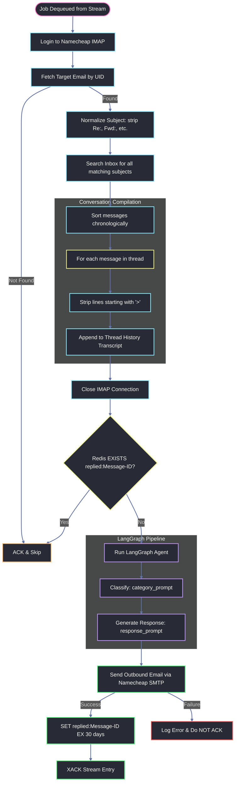
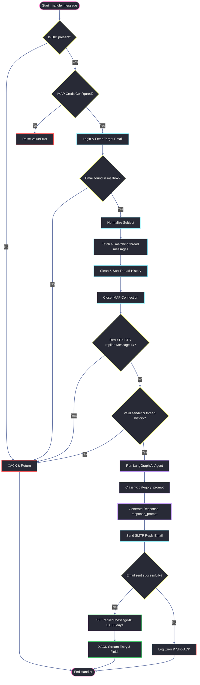

# AI Worker Microservice — Code & Flow Explanation

This document explains the internal scripts, source code, and execution flow of the **AI Worker** microservice. Every line of code is presented and explained.

---

## Execution Flow Diagram

The following Mermaid diagram outlines how a worker pod processes a stream entry (UID job) from Redis:



---

## Complete Code & Line-by-Line Breakdown

### 1. Configuration Script: `app/core/config.py`

This script manages configurations using Pydantic Settings.

#### Snippet 1.1: Imports & Class Declaration
```python
from pydantic import AliasChoices, Field
from pydantic_settings import BaseSettings, SettingsConfigDict


class Settings(BaseSettings):
```
*   `from pydantic import AliasChoices, Field`: Imports schema configuration helpers.
*   `from pydantic_settings import BaseSettings, SettingsConfigDict`: Imports base configuration loaders.
*   `class Settings(BaseSettings):`: Declares the configuration settings loader class.

#### Snippet 1.2: AI & SMTP Settings
```python
    # Google Gemini API
    GOOGLE_API_KEY: str = Field(
        validation_alias=AliasChoices("GOOGLE_API_KEY", "GEMINI_API_KEY")
    )
    MODEL_NAME: str = "gemini-3.5-flash"
    TEMPERATURE: float = 0.1

    # Namecheap SMTP (for sending replies)
    SMTP_HOST: str = "mail.privateemail.com"
    SMTP_PORT: int = 587
    SMTP_USERNAME: str | None = None
    SMTP_PASSWORD: str | None = None
    SMTP_FROM_EMAIL: str | None = None
    SMTP_FROM_NAME: str = "Customer Support"
```
*   `GOOGLE_API_KEY: str = Field(...)`: Defines the API key as a string. `validation_alias=AliasChoices(...)` allows loading the key from either `GOOGLE_API_KEY` or `GEMINI_API_KEY` environment values.
*   `MODEL_NAME: str = "gemini-3.5-flash"`: Specifies the LLM model name string, defaulting to Gemini 3.5 Flash.
*   `TEMPERATURE: float = 0.1`: Sets the generation temperature float parameter, defaulting to a deterministic `0.1`.
*   `SMTP_HOST: str = "mail.privateemail.com"`: SMTP hostname string.
*   `SMTP_PORT: int = 587`: SMTP connection port integer, defaulting to STARTTLS port `587`.
*   `SMTP_USERNAME: str | None = None`: SMTP username (email address).
*   `SMTP_PASSWORD: str | None = None`: SMTP login credentials.
*   `SMTP_FROM_EMAIL: str | None = None`: Configures the reply-from sender address.
*   `SMTP_FROM_NAME: str = "Customer Support"`: Configures display name string.

#### Snippet 1.3: IMAP, Redis settings & Instantiation
```python
    # Namecheap IMAP Settings (for fetching emails)
    IMAP_HOST: str = "mail.privateemail.com"
    IMAP_PORT: int = 993
    IMAP_USERNAME: str | None = None
    IMAP_PASSWORD: str | None = None

    # Redis Settings
    REDIS_URL: str = "redis://localhost:6379/0"
    REDIS_STREAM_NAME: str = "email:inbound"
    REDIS_CONSUMER_GROUP: str = "complaint-workers"
    # How long (seconds) to remember a replied Message-ID (30 days)
    REDIS_DEDUPE_TTL: int = 2_592_000

    model_config = SettingsConfigDict(env_file=("../../.env", ".env"), extra="ignore")


settings = Settings()
```
*   `IMAP_HOST / IMAP_PORT / IMAP_USERNAME / IMAP_PASSWORD`: Defines parameters for connecting to Namecheap IMAP.
*   `REDIS_URL`: Defines the database connection string.
*   `REDIS_STREAM_NAME`: Stream key to read from.
*   `REDIS_CONSUMER_GROUP`: Name of the joint consumer group.
*   `REDIS_DEDUPE_TTL`: Configures key survival duration (30 days in seconds).
*   `model_config = SettingsConfigDict(...)`: Specifies environment configuration paths and extra variable ignoring.
*   `settings = Settings()`: Instantiates config loading.

---

### 2. SMTP Mailer: `app/services/email.py`

This script builds and dispatches the outgoing MIME emails.

#### Snippet 2.1: Imports & Loggers
```python
import smtplib
from email.mime.multipart import MIMEMultipart
from email.mime.text import MIMEText
import logging
from app.core.config import settings

logger = logging.getLogger(__name__)
```
*   `import smtplib`: Imports Python's built-in SMTP protocol handler.
*   `from email.mime.multipart import MIMEMultipart`: Imports container class for multi-part emails.
*   `from email.mime.text import MIMEText`: Imports MIME format handler for text/plain bodies.
*   `import logging`: Standard logging package.
*   `from app.core.config import settings`: Imports application settings.
*   `logger = logging.getLogger(__name__)`: Creates the logger instance.

#### Snippet 2.2: Email Drafting & Dispatch Logic
```python
def send_support_email(
    to_email: str,
    subject: str,
    body_text: str,
    in_reply_to: str | None = None,
    references: str | None = None,
) -> bool:
    """Send an email using Namecheap Private Email SMTP."""
    if not all([settings.SMTP_USERNAME, settings.SMTP_PASSWORD, settings.SMTP_FROM_EMAIL]):
        logger.warning("SMTP credentials are not fully configured. Skipping email dispatch.")
        return False
```
*   `def send_support_email(...) -> bool:`: Defines the email dispatch function, returning boolean status.
*   `if not all([...]):`: Checks if credentials and sender settings are populated.
*   `logger.warning(...)`: Warns about missing configs.
*   `return False`: Aborts and returns `False`.

#### Snippet 2.3: MIME Construction & Header Injection
```python
    try:
        # Create message
        msg = MIMEMultipart()
        msg["From"] = f"{settings.SMTP_FROM_NAME} <{settings.SMTP_FROM_EMAIL}>"
        msg["To"] = to_email
        msg["Subject"] = subject

        if in_reply_to:
            msg["In-Reply-To"] = in_reply_to
        if references:
            msg["References"] = references

        msg.attach(MIMEText(body_text, "plain"))
```
*   `try:`: Opens SMTP operations try block.
*   `msg = MIMEMultipart()`: Instantiates the message structure object.
*   `msg["From"] = ...`: Sets formatted display sender (e.g. `Customer Support <support@domain.com>`).
*   `msg["To"] = to_email`: Sets target recipient.
*   `msg["Subject"] = subject`: Sets email subject line.
*   `if in_reply_to: msg["In-Reply-To"] = in_reply_to`: Sets threading pointer to link inside client inboxes.
*   `if references: msg["References"] = references`: Sets conversation history references for client threading.
*   `msg.attach(MIMEText(body_text, "plain"))`: Attaches plain text body content.

#### Snippet 2.4: SMTP Connections & Login
```python
        # Connect and send
        if settings.SMTP_PORT == 465:
            server = smtplib.SMTP_SSL(settings.SMTP_HOST, settings.SMTP_PORT, timeout=10)
        else:
            server = smtplib.SMTP(settings.SMTP_HOST, settings.SMTP_PORT, timeout=10)
            server.starttls()

        server.login(settings.SMTP_USERNAME, settings.SMTP_PASSWORD)
        server.send_message(msg)
        server.quit()
        logger.info("Successfully sent email to %s", to_email)
        return True
    except Exception as e:
        logger.error("Failed to send email via SMTP: %s", e)
        return False
```
*   `if settings.SMTP_PORT == 465:`: If port is standard SSL:
*   `server = smtplib.SMTP_SSL(...)`: Instantiates a secure SSL client.
*   `else: server = smtplib.SMTP(...)`: Else connects over clear socket.
*   `server.starttls()`: Upgrades clear connection to encrypted TLS channel (STARTTLS).
*   `server.login(...)`: Authenticates with SMTP login credentials.
*   `server.send_message(msg)`: Sends raw MIME email payload.
*   `server.quit()`: Terminates socket connection safely.
*   `logger.info(...)`: Logs successful delivery status.
*   `return True`: Returns success.
*   `except Exception as e:`: Captures SMTP or network exceptions.
*   `logger.error(...)`: Logs failure traceback and returns `False`.

---

### 3. AI Prompts: `app/services/agent/prompts.py`

This script declares prompts.

```python
from langchain_core.prompts import ChatPromptTemplate

category_prompt = ChatPromptTemplate.from_messages([
    ("system", "You are a helpful assistant that classifies customer complaints into one of these categories: delivery, refund, product issue, other. Respond with only the category name, nothing else."),
    ("user", "Conversation Thread:\n{input}"),
])

response_prompt = ChatPromptTemplate.from_messages([
    ("system", "You are a helpful customer service assistant that generates professional and empathetic responses. The complaint category is: {complaint_type}."),
    ("user", (
        "Generate a professional and empathetic response to the customer's latest request in the following conversation thread.\n\n"
        "Conversation Thread:\n{complaint}\n\n"
        "Note: Provide only a single response message addressing the customer's latest request, keeping the thread history in mind."
    )),
])
```
*   `from langchain_core.prompts import ChatPromptTemplate`: Imports the base chat prompt model compiler from LangChain.
*   `category_prompt = ChatPromptTemplate.from_messages(...)`: Composes the pipeline classification prompt template. It contains a system instruction forcing category names and user injection block placeholder `{input}` containing the thread transcript.
*   `response_prompt = ChatPromptTemplate.from_messages(...)`: Composes the response generation prompt template. Takes classification type variable `{complaint_type}` in system persona, and transcript variable `{complaint}` in user message block.

---

### 4. Agent Configuration: `app/services/agent/agent.py`

This script compiles the LangGraph State Graph.

#### Snippet 4.1: Imports & State definition
```python
from typing import TypedDict

from langchain_google_genai import ChatGoogleGenerativeAI
from langgraph.graph import END, START, StateGraph

from app.core.config import settings
from app.services.agent.prompts import category_prompt, response_prompt


# Canonical LangGraph state pattern: TypedDict (NOT Pydantic BaseModel)
class ComplaintState(TypedDict):
    complaint: str
    complaint_type: str
    response: str
```
*   `from typing import TypedDict`: Imports key-value type checker.
*   `from langchain_google_genai import ChatGoogleGenerativeAI`: Imports Google Gemini LLM API compiler.
*   `from langgraph.graph import END, START, StateGraph`: Imports graph components.
*   `class ComplaintState(TypedDict):`: Declares state schema.
*   `complaint: str`: Input thread history.
*   `complaint_type: str`: Category.
*   `response: str`: Output response.

#### Snippet 4.2: Gemini & Chains Definition
```python
# api_key is the preferred alias per langchain-google-genai reference docs
_llm = ChatGoogleGenerativeAI(
    model=settings.MODEL_NAME,
    temperature=settings.TEMPERATURE,
    api_key=settings.GOOGLE_API_KEY,
)

_classify_chain = category_prompt | _llm
_response_chain = response_prompt | _llm
```
*   `_llm = ChatGoogleGenerativeAI(...)`: Instantiates the Gemini client.
*   `_classify_chain = category_prompt | _llm`: Composes the classification pipeline using LCEL syntax.
*   `_response_chain = response_prompt | _llm`: Composes the response generation pipeline using LCEL syntax.

#### Snippet 4.3: Node Implementations
```python
def _node_classify(state: ComplaintState) -> dict:
    """Classify the complaint into a category."""
    ai_response = _classify_chain.invoke({"input": state["complaint"]})
    return {"complaint_type": ai_response.text.strip().lower()}


def _node_respond(state: ComplaintState) -> dict:
    """Generate a professional response to the complaint."""
    ai_response = _response_chain.invoke({
        "complaint": state["complaint"],
        "complaint_type": state["complaint_type"],
    })
    return {"response": ai_response.text}
```
*   `def _node_classify(...) -> dict:`: Classification node logic. Invokes classification chain with the state's `complaint`. Returns dict containing category updates.
*   `def _node_respond(...) -> dict:`: Response node logic. Invokes response chain with `complaint` transcript and `complaint_type` category. Returns dict containing final generated response text.

#### Snippet 4.4: Graph Composition & wrapper function
```python
_workflow = StateGraph(ComplaintState)
_workflow.add_node("classify", _node_classify)
_workflow.add_node("respond", _node_respond)
_workflow.add_edge(START, "classify")
_workflow.add_edge("classify", "respond")
_workflow.add_edge("respond", END)

_app = _workflow.compile()


def process_complaint(complaint_text: str, thread_id: str | None = None) -> dict:
    """Run the LangGraph workflow and return classification + response."""
    result = _app.invoke(
        {"complaint": complaint_text, "complaint_type": "", "response": ""}
    )
    return {
        "complaint": complaint_text,
        "complaint_type": result["complaint_type"],
        "response": result["response"],
    }
```
*   `_workflow = StateGraph(ComplaintState)`: Instantiates the state workflow builder.
*   `add_node(...)`: Registers nodes.
*   `add_edge(...)`: Connects nodes.
*   `compile()`: Builds executable graph.
*   `def process_complaint(...)`: Wrapper entry function executing workflow and returning result dictionary.

---

### 5. Main Execution: `app/main.py`

This is the main worker loop and pipeline orchestrator.

#### Snippet 5.1: Docstring & Imports
```python
"""
Worker microservice — entry point.
[Responsibilities and Scaling metadata...]
"""

import logging
import socket
import time

import redis
from imap_tools import AND, MailBox

from app.core.config import settings
from app.services.agent.agent import process_complaint
from app.services.email import send_support_email
```
*   Standard imports: logger, socket (for container hostname), time, redis, `imap-tools` and app service modules.

#### Snippet 5.2: Replica-logging Setup
```python
logging.basicConfig(
    level=logging.INFO,
    format="%(asctime)s [worker/%(hostname)s] %(levelname)s %(message)s",
    datefmt="%Y-%m-%dT%H:%M:%S",
)

# Include hostname in every log line so you can distinguish replicas
_hostname = socket.gethostname()
logging.getLogger().handlers[0].setFormatter(
    logging.Formatter(
        fmt=f"%(asctime)s [worker/{_hostname}] %(levelname)s %(message)s",
        datefmt="%Y-%m-%dT%H:%M:%S",
    )
)

logger = logging.getLogger(__name__)
```
*   Configures global logging system. Sets formatter to inject container `_hostname` dynamically into every log message, enabling troubleshooting across multiple running replicas.

#### Snippet 5.3: Redis client & Consumer Group Checks
```python
def _build_redis_client() -> redis.Redis:
    """Create Redis client with retry on startup."""
    client = redis.from_url(settings.REDIS_URL, decode_responses=True, socket_timeout=15)
    client.ping()
    logger.info("Connected to Redis at %s", settings.REDIS_URL)
    return client


def _ensure_consumer_group(r: redis.Redis) -> None:
    """
    Create the consumer group if it doesn't exist yet.
    MKSTREAM creates the stream key if it's also missing.
    '$' means: only process NEW messages added after group creation.
    """
    try:
        r.xgroup_create(
            name=settings.REDIS_STREAM_NAME,
            groupname=settings.REDIS_CONSUMER_GROUP,
            id="$",
            mkstream=True,
        )
        logger.info(
            "Created consumer group '%s' on stream '%s'.",
            settings.REDIS_CONSUMER_GROUP,
            settings.REDIS_STREAM_NAME,
        )
    except redis.exceptions.ResponseError as exc:
        if "BUSYGROUP" in str(exc):
            # Group already exists — this is fine (other worker replica created it first)
            logger.debug("Consumer group already exists — OK.")
        else:
            raise
```
*   `_ensure_consumer_group(r)`: Runs group initialization.
*   `r.xgroup_create(...)`: Creates consumer group.
*   `id="$"`: Configures to read new messages added after creation.
*   `mkstream=True`: Creates stream if missing.
*   `except ResponseError as exc: if "BUSYGROUP" in str(exc):`: Catches already-exists errors silently when multiple replicas startup concurrently. This ensures scaling works seamlessly: the first starting replica creates the group, and subsequent replicas safely reuse it.

#### Snippet 5.4: Deduplication Key Creator
```python
def _dedupe_key(message_id: str) -> str:
    return f"replied:{message_id}"
```
*   Returns formatted Redis lookup key for deduplication check.

---

### Detailed `_handle_message` Execution Flow

The `_handle_message` function is the core of the worker service. It processes a single job from the Redis Stream, compiling a thread transcript from IMAP, running the LangGraph AI agent, sending the SMTP response, and acknowledging the queue entry.

Here is a step-by-step execution flow of the handler:



---

#### Snippet 5.5: Processing Handler — UID validation
```python
def _handle_message(r: redis.Redis, stream_entry_id: str, fields: dict) -> None:
    """
    Process a single email from the stream by fetching it from IMAP using UID.
    Always ACKs the message if handled successfully or if it's an unrecoverable/skipped scenario.
    """
    uid = fields.get("uid", "")
    
    logger.info("Received job for email UID %s (stream_id=%s)", uid, stream_entry_id)

    if not uid:
        logger.warning("No UID found in stream entry %s — skipping.", stream_entry_id)
        
        r.xack(settings.REDIS_STREAM_NAME, settings.REDIS_CONSUMER_GROUP, stream_entry_id)
        return

    if not (settings.IMAP_USERNAME and settings.IMAP_PASSWORD):
        logger.error("IMAP settings are not configured in worker — cannot fetch email %s", uid)
        
        raise ValueError("IMAP settings are not configured in worker.")
```
*   `uid = fields.get("uid", "")`: Extracts incoming email UID.
*   `if not uid:`: If UID is empty, ignores it, acknowledges it (`xack`) to dequeue from stream, and returns.
*   `if not (IMAP config)`: Raises validation error if mail credentials are missing on the worker container, preventing incorrect queue pop.

#### Snippet 5.6: Processing Handler — On-Demand Thread Compiling
```python
    try:
        # ── 1. Fetch email and its thread history from IMAP on-demand ────────
        with MailBox(settings.IMAP_HOST, port=settings.IMAP_PORT, timeout=15).login(
            settings.IMAP_USERNAME, settings.IMAP_PASSWORD
        ) as mailbox:
            messages = list(mailbox.fetch(AND(uid=uid)))
            
            if not messages:
                logger.warning("Email with UID %s not found in mailbox — skipping.", uid)
                
                r.xack(settings.REDIS_STREAM_NAME, settings.REDIS_CONSUMER_GROUP, stream_entry_id)
                return
            
            msg = messages[0]
            from_email = msg.from_
            subject = msg.subject or "(no subject)"
            message_id = msg.obj.get("Message-ID", "").strip()
            references = msg.obj.get("References", "").strip()
            in_reply_to = msg.obj.get("In-Reply-To", "").strip()
            
            thread_id = (
                in_reply_to
                or references
                or message_id
                or f"thread_{abs(hash(from_email + subject)) % 100_000}"
            )

            def normalize_subject(subj: str) -> str:
                s = subj.lower()
                for prefix in ["re:", "fwd:", "fw:"]:
                    if s.startswith(prefix):
                        s = s[len(prefix):].strip()
                return s.strip()

            norm_subj = normalize_subject(subject)

            thread_messages = list(mailbox.fetch(AND(subject=norm_subj)))
            thread_messages.sort(key=lambda m: m.date or m.date_str)

            thread_history = ""
            for m in thread_messages:
                m_sender = m.from_
                m_date = m.date.strftime("%Y-%m-%d %H:%M:%S") if m.date else "Unknown Date"
                m_body = m.text.strip() if m.text else m.html.strip() if m.html else ""
                
                clean_lines = [line for line in m_body.splitlines() if not line.strip().startswith(">")]
                clean_body = "\n".join(clean_lines).strip()
                
                thread_history += f"From: {m_sender} (Date: {m_date})\nSubject: {m.subject}\nContent:\n{clean_body}\n\n---\n\n"

        logger.info(
            "Fetched thread history for subject=%r (%d message(s), message_id=%s)",
            subject,
            len(thread_messages),
            message_id,
        )
```
*   `mailbox.fetch(AND(uid=uid))`: Fetches target email object.
*   `if not messages: r.xack(...)`: If message has been deleted/moved since polling, acknowledges it and aborts.
*   `thread_id = ...`: Fallback algorithm creating unique string ID for tracking.
*   `normalize_subject(subject)`: Removes standard forward/reply email subject prefixes.
*   `mailbox.fetch(AND(subject=norm_subj))`: Fetches all emails matching normalized thread title.
*   `thread_messages.sort(...)`: Sorts emails chronologically.
*   `clean_lines = ...`: Filters out quoted text lines (starting with `>`), cleaning output.
*   `thread_history += ...`: Formats and compiles the historical messages string transcript.

#### Snippet 5.7: Processing Handler — Dedupe, Agent & Dispatch
```python
        # ── 2. Dedupe check ─────────────────────────────────────────────────
        if message_id:
            key = _dedupe_key(message_id)
            if r.exists(key):
                logger.warning(
                    "Already replied to Message-ID %s — skipping duplicate.", message_id
                )
                
                r.xack(settings.REDIS_STREAM_NAME, settings.REDIS_CONSUMER_GROUP, stream_entry_id)
                return
        else:
            logger.warning("Email has no Message-ID header — dedupe not possible.")

        # ── 3. Validate ────────────────-------------------------------------
        if not from_email or not thread_history.strip():
            logger.warning("Missing from_email or thread history — skipping.")
            
            r.xack(settings.REDIS_STREAM_NAME, settings.REDIS_CONSUMER_GROUP, stream_entry_id)
            return

        # ── 4. Run LangGraph AI agent ────────────────────────────────────────
        logger.info("Running LangGraph complaint handler for thread_id=%s", thread_id)
        
        result = process_complaint(thread_history, thread_id=thread_id)
        
        logger.info("Classified as: %s", result["complaint_type"])
```
*   `if r.exists(key):`: Checks if deduplication key exists in Redis. If yes, runs `xack()` to prevent duplicate reply.
*   `if not from_email or not thread_history.strip():`: Aborts if email payload content is empty.
*   `process_complaint(...)`: Invokes LangGraph processing pipeline.

#### Snippet 5.8: Processing Handler — SMTP Send & Queue Acknowledge
```python
        # ── 5. Build reply subject ──────────────────────────────────────────
        reply_subject = subject if subject.lower().startswith("re:") else f"Re: {subject}"

        # ── 6. Send SMTP reply ──────────────────────────────────────────────
        sent = send_support_email(
            to_email=from_email,
            subject=reply_subject,
            body_text=result["response"],
            in_reply_to=message_id or None,
            references=f"{references} {message_id}".strip() or None,
        )

        # ── 7. Mark as replied in Redis ─────────────────────────────────────
        if sent and message_id:
            r.set(_dedupe_key(message_id), "1", ex=settings.REDIS_DEDUPE_TTL)
            
            logger.info("Marked Message-ID %s as replied (TTL=%ds).", message_id, settings.REDIS_DEDUPE_TTL)

        # ── 8. Success ACK ──────────────────────────────────────────────────
        r.xack(settings.REDIS_STREAM_NAME, settings.REDIS_CONSUMER_GROUP, stream_entry_id)
        
        logger.info("Successfully processed and ACKed stream entry %s", stream_entry_id)

    except Exception as exc:  # noqa: BLE001
        logger.error("Error processing message %s: %s", stream_entry_id, exc)
```
*   `reply_subject = ...`: Ensures outgoing subject starts with standard `Re:` prefix.
*   `send_support_email(...)`: Sends outgoing reply email via SMTP.
*   `r.set(...)`: Writes deduplication key with 30-day TTL.
*   `r.xack(...)`: Acknowledges stream message, popping it from consumer group PEL.
*   `except Exception as exc:`: Logs exception but does not run `XACK` on connection or API failures, enabling retry.

#### Snippet 5.9: Worker Main loop
```python
def run() -> None:
    """Consume the Redis Stream forever."""

    # Retry Redis connection on startup (Redis container may not be ready yet)
    r: redis.Redis | None = None
    while r is None:
        try:
            r = _build_redis_client()
        except Exception as exc:  # noqa: BLE001
            logger.warning("Redis not ready yet (%s) — retrying in 3s…", exc)
            time.sleep(3)

    _ensure_consumer_group(r)

    logger.info(
        "Worker started. stream=%s group=%s consumer=%s",
        settings.REDIS_STREAM_NAME,
        settings.REDIS_CONSUMER_GROUP,
        _hostname,
    )
```
*   Initializes database client connection with standard startup retries.
*   Invokes consumer group registration block.

#### Snippet 5.10: XREADGROUP Stream Listener Loop
```python
    while True:
        try:
            # XREADGROUP: block up to 5 seconds waiting for a new message.
            # ">" means "give me messages not yet delivered to any consumer."
            # COUNT 10 means process up to 10 emails per batch.
            response = r.xreadgroup(
                groupname=settings.REDIS_CONSUMER_GROUP,
                consumername=_hostname,
                streams={settings.REDIS_STREAM_NAME: ">"},
                count=10,
                block=5000,  # ms
            )

            if not response:
                # Timeout — no new messages, loop back
                continue

            # response shape: [(stream_name, [(entry_id, fields_dict), ...])]
            for _stream_name, entries in response:
                for entry_id, fields in entries:
                    _handle_message(r, entry_id, fields)

        except redis.exceptions.TimeoutError:
            # Normal socket read timeout on blocking read (no messages)
            continue

        except redis.exceptions.ConnectionError as exc:
            logger.error("Redis connection lost: %s — retrying in 5s…", exc)
            time.sleep(5)

        except Exception as exc:  # noqa: BLE001
            logger.error("Unexpected error in worker loop: %s", exc)
            time.sleep(1)


if __name__ == "__main__":
    run()
```
*   `while True:`: Enters an infinite loop so the worker container runs forever, constantly listening for incoming jobs.
*   `try:`: Opens the main try-except block to protect the infinite loop from crashing due to unexpected network drops or errors.
*   `response = r.xreadgroup(`: Invokes the Redis `XREADGROUP` command to fetch messages as a member of a consumer group.
*   `groupname=settings.REDIS_CONSUMER_GROUP,`: Identifies the group name (`complaint-workers`) that manages load balancing across all workers.
*   `consumername=_hostname,`: Passes the specific container's hostname as the consumer name, which Redis uses to assign and track pending tasks in the Pending Entry List (PEL).
*   `streams={settings.REDIS_STREAM_NAME: ">"},`: Specifies the Redis stream key to query, using the special `">"` ID value which tells Redis to only return new messages that have never been delivered to any other consumer in this group.
*   `count=10,`: Restricts the read size to a maximum of 10 stream entries per batch to prevent overloading the worker replica.
*   `block=5000,`: Instructs Redis to block (wait) for up to 5,000 milliseconds (5 seconds) if there are no new messages in the queue, returning immediately as soon as a new message is pushed.
*   `if not response:`: Checks if the response is empty (which happens if the 5-second block timed out with zero new messages in the stream).
*   `continue`: Returns to the beginning of the `while True:` loop to issue another read command.
*   `for _stream_name, entries in response:`: Iterates through the list of stream responses returned by Redis (since `xread` can query multiple streams at once).
*   `for entry_id, fields in entries:`: Loops through the batch of message entries (consisting of the unique stream ID and payload fields) returned for the stream.
*   `_handle_message(r, entry_id, fields)`: Dispatches the entry ID and payload dictionary (containing the email UID) to the message handler to compile history, process via LangGraph, and send SMTP replies.
*   `except redis.exceptions.TimeoutError:`: Catches the socket read timeout raised if the blocking read expires without receiving data.
*   `continue`: Ignores it and safely loops back to poll again.
*   `except redis.exceptions.ConnectionError as exc:`: Catches connection loss errors when the Redis server goes offline.
*   `logger.error("Redis connection lost: %s — retrying in 5s…", exc)`: Logs a connection lost warning.
*   `time.sleep(5)`: Sleeps for 5 seconds to throttle retries and avoid spamming log outputs while the database is offline.
*   `except Exception as exc:`: Catches all other unexpected standard exceptions to prevent the worker container from crashing.
*   `logger.error("Unexpected error in worker loop: %s", exc)`: Logs the unexpected traceback for diagnostics.
*   `time.sleep(1)`: Sleeps for 1 second before retrying the loop to prevent tight loop utilization on errors.
*   `if __name__ == "__main__":`: Python entrypoint check to ensure the worker starts running only when executed directly as a script.
*   `run()`: Invokes the main initialization and loop orchestration function.
