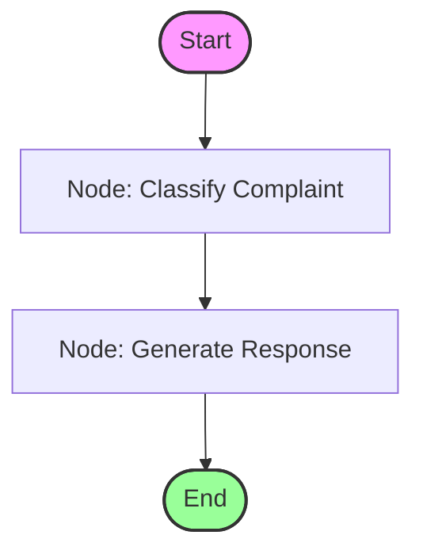

# Customer Complaint Responder — Backend

<p align="center">
  
  
  
  
</p>

FastAPI backend that classifies customer complaints and automatically generates professional email/message responses using **LangGraph** orchestration and **Google Gemini** language models.

---

## 🛠️ Tech Stack & Key Libraries

- **FastAPI**: Modern, high-performance web framework for building APIs.
- **LangGraph**: State machine agent framework to orchestrate workflow nodes (Classification, Response drafting).
- **LangChain Google GenAI**: Integration wrapper for utilizing Google's Gemini models (`ChatGoogleGenerativeAI`).
- **Pydantic / Pydantic Settings**: Data validation, type safety, and robust environment configuration management.
- **UV**: Fast Python package installer and resolver.
- **Docker**: For containerized deployment.

---

## 🧭 Workflow Architecture

The application implements a structured, state-driven workflow using LangGraph:



1. **`classify` node**: Analyzes the complaint and returns a categorized type (e.g., `refund`, `shipping delay`, `technical support`).
2. **`respond` node**: Generates a professional, contextual resolution drafted according to the identified complaint category.
3. **`MemorySaver`**: Captures state checkpointers to support thread persistence.

---

## ⚙️ Configuration & Environment

Create a `.env` file in either the **project root** (one level above `backend/`) or within the `backend/` directory:

```env
# Google Gemini API Credentials (choose either)
GOOGLE_API_KEY=your_gemini_api_key_here
# or
GEMINI_API_KEY=your_gemini_api_key_here

# Optional Configurations (defaults shown)
MODEL_NAME=gemini-3-flash-preview
TEMPERATURE=0.1
```

| Environment Variable | Description | Default |
|:---|:---|:---|
| `GOOGLE_API_KEY` / `GEMINI_API_KEY` | **Required**. Authentication key for Google Generative AI APIs. | *None* |
| `MODEL_NAME` | The Gemini LLM model identifier. | `gemini-3-flash-preview` |
| `TEMPERATURE` | Control creativity/determinism (0.0 = deterministic). | `0.1` |

---

## 🚀 Setup & Execution

### 1. Local Development Setup

To manage dependencies fast and reliably, we recommend using **`uv`**:

```bash
# Install dependencies into a virtual environment
uv pip install -e .
```

### 2. Run the Server

Start the ASGI server with hot reloading enabled for local development:

```bash
uvicorn app.main:app --reload
```

The service is now available locally at: **`http://localhost:8000`**  
Access the interactive OpenAPI docs at: **`http://localhost:8000/docs`**

---

## 🐳 Docker Deployment

The backend contains a production-ready `Dockerfile` using Alpine and `uv`.

### Build Image
```bash
docker build -t customer_complaint_responder .
```

### Run Container
Inject your credentials dynamically at runtime via the environment flag:
```bash
docker run -p 8000:8000 -e GEMINI_API_KEY=your_gemini_api_key_here customer_complaint_responder
```

---

## 🔌 API Documentation

### 1. Health Check
Checks the server health status.

* **URL**: `/health`
* **Method**: `GET`
* **Response (`200 OK`)**:
  ```json
  {
    "status": "healthy"
  }
  ```

### 2. Process Complaint
Submits a customer complaint text to be categorized and answered.

* **URL**: `/api/v1/complaints`
* **Method**: `POST`
* **Request Headers**: `Content-Type: application/json`
* **Request Body**:
  ```json
  {
    "complaint": "I received my order #10432 today but it was missing the power cable.",
    "thread_id": "thread-12345"
  }
  ```
  *(Note: `thread_id` is optional and defaults to a hashed session identifier if omitted.)*

* **Response (`200 OK`)**:
  ```json
  {
    "complaint": "I received my order #10432 today but it was missing the power cable.",
    "complaint_type": "missing item",
    "response": "Dear Customer,\n\nWe sincerely apologize for the inconvenience. We have initiated a replacement order for the missing power cable..."
  }
  ```
