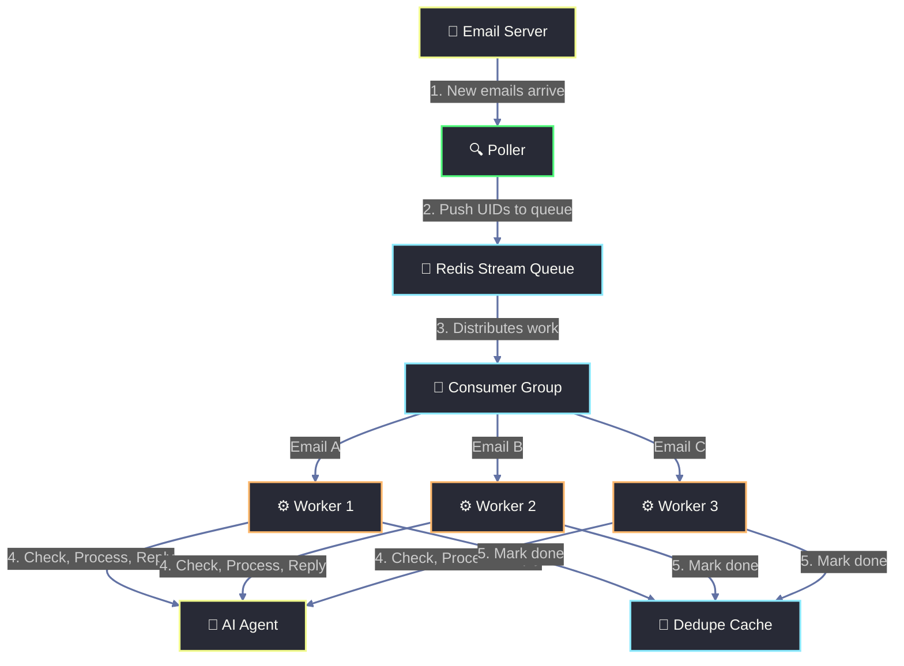

# Redis Streams & Consumer Groups: Simple Guide

This document explains how **Redis**, **Redis Streams**, and **Consumer Groups** work in this project. 

If you are new to Redis, think of it as a super-fast message queue and helper database that connects the **Poller** and **Worker** microservices.

---

## 1. The Post Office Analogy (How it Works)

To make it easy, let's look at a real-world analogy:

```
[📬 Inbox] ──(Mail arrives)
   │
   ▼
[🚚 Mail Carrier]  (Poller Service)
   │  Checks the mailbox, grabs the letter's tracking number,
   │  and drops it in the shared bin.
   ▼
[📦 Shared Bin]  (Redis Stream)
   │  An ordered pile where letters are stored in the order they arrived.
   ▼
[👥 Postal Supervisor]  (Consumer Group)
   │  Distributes letters. Ensures two clerks never get the same letter.
   ▼
[⚙️ Postal Clerks]  (Worker Replicas)
   │  Clerk A and Clerk B take letters from the supervisor to work on.
   │  - While working, the letter sits on the clerk's desk (Pending List).
   │  - If a clerk gets sick, the supervisor reassigns the letter.
   │  - When finished, the clerk stamps it "DONE" (XACK).
   ▼
[📖 Record Book]  (Deduplication Cache)
   │  Clerks write down every completed letter ID.
   │  If they ever see the same ID again, they skip it so they don't reply twice.
```

---

## 2. How Multiple Workers Share the Load

Imagine 3 emails arrive. The Consumer Group hands each email to **only one** worker — no duplicates:

```
Email A ──┐
Email B ──┤──▶ [Consumer Group] ──┬──▶ Worker 1 gets Email A ✅
Email C ──┘                       ├──▶ Worker 2 gets Email B ✅
                                  └──▶ Worker 1 gets Email C ✅
                                        (Worker 2 was busy)
```

---

## 3. Simplified Flow Diagram



---

## 4. Core Concepts Explained Simply

### A. What is a Redis Stream?
A **Redis Stream** is a **durable, ordered queue**.
* Unlike standard temporary queues, it remembers the history of messages.
* Every message pushed to the stream gets a unique ID with a timestamp (for example, `1719220035041-0`).
* In our app, we only store the email's lightweight **UID** in the stream.

### B. What is a Consumer Group?
A **Consumer Group** is a **load balancer** for your queue.
* If you have 3 worker containers running, you don't want them all processing the exact same email.
* The Consumer Group ensures that **only one worker** handles each email.
* It maintains a **Pending Entry List (PEL)**. When a worker is given an email, Redis remembers: *"Worker 1 is currently processing email UID 45. Do not hand it to anyone else."*
* When the worker finishes and calls `XACK` (acknowledge), the task is removed from the pending list.

### C. What is the Deduplication Cache?
The **Deduplication Cache** is our **double-reply insurance policy**.
* If a worker crashes or restarts mid-way, the message might be sent again (at-least-once delivery).
* To prevent sending the customer two AI replies, the worker saves the email's `Message-ID` in Redis with a 30-day expiration timer.
* Before processing any email, a worker checks this cache. If the key exists, it skips sending the email and simply confirms completion (`XACK`) to clean up the queue.

---

## 5. Simple Command Guide

Here are the 6 basic commands our code runs, translated into plain English:

### 1. `XADD` (Add to Queue)
* **What it does**: Drops a new email UID into the stream.
* **Used in**: [poller/app/main.py](file:///home/selva/Documents/langchain-projects/Customer_Complaint_Responder/apps/poller/app/main.py#L67)
* **Simple Example**:
  ```python
  r.xadd("email:inbound", {"uid": "23"})
  ```
  *Translation: "Add email UID 23 to the stream named `email:inbound`."*

### 2. `XGROUP CREATE` (Setup Group)
* **What it does**: Creates the supervisor group so workers can share the load.
* **Used in**: [worker/app/main.py](file:///home/selva/Documents/langchain-projects/Customer_Complaint_Responder/apps/worker/app/main.py#L61)
* **Simple Example**:
  ```python
  r.xgroup_create("email:inbound", "complaint-workers", id="$", mkstream=True)
  ```
  *Translation: "Create a consumer group called `complaint-workers` for the stream. Start reading from now ($) onwards, and create the stream if it doesn't exist yet."*

### 3. `XREADGROUP` (Fetch Work)
* **What it does**: A worker asks the supervisor for new messages.
* **Used in**: [worker/app/main.py](file:///home/selva/Documents/langchain-projects/Customer_Complaint_Responder/apps/worker/app/main.py#L224)
* **Simple Example**:
  ```python
  r.xreadgroup("complaint-workers", "worker-1", {"email:inbound": ">"}, count=10)
  ```
  *Translation: "As `worker-1` in the `complaint-workers` group, read up to 10 brand-new messages (`>`) from the stream."*

### 4. `EXISTS` (Check Cache)
* **What it does**: Checks if we already replied to this email.
* **Used in**: [worker/app/main.py](file:///home/selva/Documents/langchain-projects/Customer_Complaint_Responder/apps/worker/app/main.py#L160)
* **Simple Example**:
  ```python
  r.exists("replied:<message-id>")
  ```
  *Translation: "Check if there's a record saying we already replied to `<message-id>`."*

### 5. `SET` with expiration (Save to Cache)
* **What it does**: Marks an email message ID as replied-to for the next 30 days.
* **Used in**: [worker/app/main.py](file:///home/selva/Documents/langchain-projects/Customer_Complaint_Responder/apps/worker/app/main.py#L189)
* **Simple Example**:
  ```python
  r.set("replied:<message-id>", "1", ex=2592000)
  ```
  *Translation: "Save the record for `<message-id>` and delete it automatically in 30 days (2,592,000 seconds)."*

### 6. `XACK` (Confirm Done)
* **What it does**: Tells the queue manager the job is done, removing it from the pending list.
* **Used in**: [worker/app/main.py](file:///home/selva/Documents/langchain-projects/Customer_Complaint_Responder/apps/worker/app/main.py#L192)
* **Simple Example**:
  ```python
  r.xack("email:inbound", "complaint-workers", "1719220035041-0")
  ```
  *Translation: "Mark message `1719220035041-0` as fully processed and done."*

---

## 6. Useful Commands for Troubleshooting

If you want to inspect what is happening inside the queue, open a terminal and run:

1. **Log in to Redis**:
   ```bash
   docker compose exec redis redis-cli
   ```
2. **Check how many messages are waiting in the queue**:
   ```bash
   XLEN email:inbound
   ```
3. **See if any workers are active or have pending messages**:
   ```bash
   XINFO GROUPS email:inbound
   ```
4. **See which messages are stuck (delivered but not completed)**:
   ```bash
   XPENDING email:inbound complaint-workers - + 10
   ```
